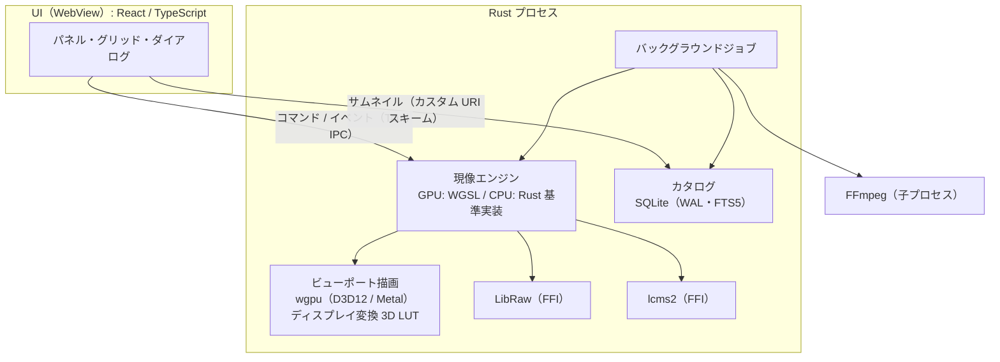

# [3] 技術選定

- 入力: `prompts/premise_sheet.md`、`docs/01_feature_inventory.md`、`docs/02_nonfunctional_requirements.md`、`docs/decision_log.md`
- 位置づけ: たたき台。**最終決定は PoC（[5]）の結果を見て行う** 前提です。
- 情報の確度について
  - ライブラリのライセンス・対応状況・保守状況は、2026 年 10 月時点での記憶に基づく情報を含みます。「要確認」と書いた箇所は、採用前に公式サイト・リポジトリ・LICENSE ファイルで必ず確認してください。
  - 採点（1〜5）は主観的な評価です。加重スコアと感度分析は、採点を元にスクリプトで計算しました。

---

## 1. 評価方法

### 1.1 評価軸と重み

前提条件の重視点（1. 画質・色、2. 軽快さ）と、AI が保守する前提を反映して、重みを決めました。

| 評価軸 | 重み | 内容 |
|---|---:|---|
| 性能 | 5 | 重視点 2。PERF 系の非機能要件を満たせるか |
| 画質・色の制御性 | 5 | 重視点 1。色空間・精度・表示の色管理を自分たちで制御できるか |
| AI 保守性 | 4 | 型の強さ、コンパイラ・テストで誤りを検出しやすいか、AI の学習データとなる情報の多さ、API の安定性 |
| 成熟度・保守状況 | 4 | 実績と、開発が活発に続いているか |
| Win / mac 対応 | 3 | Windows 11 と macOS（Apple Silicon）の両方で、同じ品質で動くか |
| 配布の容易さ | 2 | インストーラーの作りやすさ、依存関係の同梱しやすさ |
| ライセンス適合 | 1 | GPL が使える前提なので、ほとんどの候補で問題にならない。そのため重みは小さくした |

加重スコア = Σ（採点 × 重み）÷ 重みの合計（5 点満点）

### 1.2 感度分析

評価軸ごとに重みを 0 倍（その軸を無視）と 2 倍（その軸を重視）にして、1 位が入れ替わるかを確認しました。入れ替わる場合は、**その評価軸をどれだけ重視するかが結論を左右する論点** です。

---

## 2. レイヤー別の比較

#### UI / アプリ形態

| 順位 | 候補 | 加重スコア | 性能 | 画質・色の制御性 | AI保守性 | 成熟度・保守状況 | Win/mac対応 | 配布の容易さ | ライセンス適合 |
|---|---|---:|---:|---:|---:|---:|---:|---:|---:|
| 1 | Qt 6（QML）＋ C++ | **4.25** | 5 | 4 | 3 | 5 | 5 | 3 | 4 |
| 2 | Tauri 2 + Web UI（React/TS）＋ ネイティブ描画のビューポート | **4.04** | 4 | 4 | 5 | 3 | 4 | 4 | 5 |
| 3 | Electron + Web UI（React/TS） | **4.00** | 3 | 3 | 5 | 5 | 5 | 3 | 5 |
| 4 | Rust ネイティブ UI（Slint / egui / iced）＋ wgpu | **4.00** | 5 | 5 | 3 | 2 | 4 | 5 | 4 |
| 5 | OS ネイティブ UI（SwiftUI と WinUI 3）＋ Rust コア | **3.96** | 5 | 5 | 3 | 4 | 2 | 3 | 5 |

- 1 位と 2 位の差: 0.21
- 感度分析: 「性能」の重みを 0 倍にすると → Electron + Web UI（React/TS）、「AI保守性」の重みを 2 倍にすると → Tauri 2 + Web UI（React/TS）＋ ネイティブ描画のビューポート、「成熟度・保守状況」の重みを 0 倍にすると → Rust ネイティブ UI（Slint / egui / iced）＋ wgpu、「Win/mac対応」の重みを 0 倍にすると → OS ネイティブ UI（SwiftUI と WinUI 3）＋ Rust コア

#### コア言語

| 順位 | 候補 | 加重スコア | 性能 | 画質・色の制御性 | AI保守性 | 成熟度・保守状況 | Win/mac対応 | 配布の容易さ | ライセンス適合 |
|---|---|---:|---:|---:|---:|---:|---:|---:|---:|
| 1 | Rust | **4.62** | 5 | 4 | 5 | 4 | 5 | 5 | 5 |
| 2 | C# / .NET | **4.04** | 4 | 4 | 4 | 4 | 4 | 4 | 5 |
| 3 | C++ | **4.00** | 5 | 4 | 2 | 5 | 4 | 3 | 5 |

- 1 位と 2 位の差: 0.58
- 感度分析: 各評価軸の重みを 0 倍〜2 倍にしても 1 位は変わらない

#### RAW デコード（展開とメタデータ。デモザイクは自前）

| 順位 | 候補 | 加重スコア | 性能 | 画質・色の制御性 | AI保守性 | 成熟度・保守状況 | Win/mac対応 | 配布の容易さ | ライセンス適合 |
|---|---|---:|---:|---:|---:|---:|---:|---:|---:|
| 1 | LibRaw | **4.12** | 3 | 4 | 4 | 5 | 5 | 4 | 5 |
| 2 | RawSpeed | **3.83** | 5 | 4 | 2 | 4 | 4 | 3 | 5 |
| 3 | rawler（Rust） | **3.71** | 4 | 3 | 4 | 2 | 5 | 5 | 5 |

- 1 位と 2 位の差: 0.29
- 感度分析: 「性能」の重みを 2 倍にすると → RawSpeed、「AI保守性」の重みを 0 倍にすると → RawSpeed、「成熟度・保守状況」の重みを 0 倍にすると → rawler（Rust）

#### 現像パイプラインの実行基盤

| 順位 | 候補 | 加重スコア | 性能 | 画質・色の制御性 | AI保守性 | 成熟度・保守状況 | Win/mac対応 | 配布の容易さ | ライセンス適合 |
|---|---|---:|---:|---:|---:|---:|---:|---:|---:|
| 1 | wgpu（WGSL）＋ Rust による CPU 基準実装 | **4.46** | 5 | 4 | 4 | 4 | 5 | 5 | 5 |
| 2 | Halide | **3.88** | 5 | 5 | 2 | 3 | 4 | 3 | 5 |
| 3 | Slang（1 つのソースから GPU / CPU 向けに生成） | **3.71** | 5 | 5 | 2 | 2 | 4 | 3 | 5 |
| 4 | Vulkan 直接（macOS は MoltenVK） | **3.71** | 5 | 4 | 2 | 4 | 3 | 3 | 5 |
| 5 | OpenCL | **3.38** | 4 | 4 | 3 | 3 | 2 | 3 | 5 |

- 1 位と 2 位の差: 0.58
- 感度分析: 各評価軸の重みを 0 倍〜2 倍にしても 1 位は変わらない

#### カタログ DB

| 順位 | 候補 | 加重スコア | 性能 | 画質・色の制御性 | AI保守性 | 成熟度・保守状況 | Win/mac対応 | 配布の容易さ | ライセンス適合 |
|---|---|---:|---:|---:|---:|---:|---:|---:|---:|
| 1 | SQLite（WAL・FTS5） | **4.58** | 4 | 4 | 5 | 5 | 5 | 5 | 5 |
| 2 | DuckDB | **4.00** | 4 | 4 | 4 | 3 | 5 | 4 | 5 |
| 3 | 組み込み KV（redb / LMDB）＋ 自前インデックス | **3.96** | 5 | 4 | 2 | 3 | 5 | 5 | 5 |

- 1 位と 2 位の差: 0.58
- 感度分析: 各評価軸の重みを 0 倍〜2 倍にしても 1 位は変わらない

#### 動画（サムネイル・メタデータ）

| 順位 | 候補 | 加重スコア | 性能 | 画質・色の制御性 | AI保守性 | 成熟度・保守状況 | Win/mac対応 | 配布の容易さ | ライセンス適合 |
|---|---|---:|---:|---:|---:|---:|---:|---:|---:|
| 1 | FFmpeg（CLI を子プロセスで実行） | **4.38** | 4 | 4 | 5 | 5 | 5 | 3 | 4 |
| 2 | OS 標準（AVFoundation と Media Foundation） | **4.08** | 5 | 4 | 3 | 5 | 2 | 5 | 5 |
| 3 | FFmpeg（ライブラリを直接リンク） | **3.96** | 5 | 4 | 3 | 4 | 4 | 3 | 4 |

- 1 位と 2 位の差: 0.29
- 感度分析: 「AI保守性」の重みを 0 倍にすると → OS 標準（AVFoundation と Media Foundation）、「Win/mac対応」の重みを 0 倍にすると → OS 標準（AVFoundation と Media Foundation）

#### メタデータ（EXIF など）

| 順位 | 候補 | 加重スコア | 性能 | 画質・色の制御性 | AI保守性 | 成熟度・保守状況 | Win/mac対応 | 配布の容易さ | ライセンス適合 |
|---|---|---:|---:|---:|---:|---:|---:|---:|---:|
| 1 | Exiv2（FFI 経由） | **4.21** | 5 | 4 | 3 | 5 | 4 | 4 | 4 |
| 2 | ExifTool（常駐プロセス） | **3.96** | 2 | 5 | 5 | 5 | 4 | 2 | 4 |
| 3 | Rust のライブラリ（kamadak-exif など）＋ 不足分を自作 | **3.92** | 5 | 3 | 4 | 2 | 5 | 5 | 5 |

- 1 位と 2 位の差: 0.25
- 感度分析: 「性能」の重みを 0 倍にすると → ExifTool（常駐プロセス）、「AI保守性」の重みを 2 倍にすると → ExifTool（常駐プロセス）、「成熟度・保守状況」の重みを 0 倍にすると → Rust のライブラリ（kamadak-exif など）＋ 不足分を自作

### 2.1 各レイヤーの補足

**UI / アプリ形態**
- 単体の採点では **Qt 6 が 1 位** ですが、2 位との差は 0.21 と小さく、感度分析でも 1 位が入れ替わりやすい（4 つの条件で入れ替わる）ため、**単体では決められません**。
- Qt 6 は C++ で書くのが自然です。コア言語で大差の 1 位になった Rust と組み合わせると、Qt と Rust の間をつなぐ層（cxx-qt など）が必要になり、AI にとって扱いにくくなります。そのため、**スタック全体での評価（3 章）で判断** します。
- Web 系の UI（Tauri / Electron）には、**現像画像の表示経路** という固有の課題があります。WebView の中の canvas に画像を送ると、プレビュー 1 フレームあたり十数 MB（2560 × 1440 × 4 バイト ≒ 14.7MB）のデータ転送が必要になり、30fps の目標（PERF-01）が厳しくなります。また、WebView の色管理は OS とブラウザエンジンに任せることになり、細かく制御できません。
  - そこで Tauri 案では、**画像の表示領域（ビューポート）だけを Rust 側から wgpu でネイティブに描画** し、その上に透明な WebView を重ねて UI パネルを表示する構成を想定しています。この構成が Windows と macOS の両方で安定して動くかは **未検証** です（PoC-1 で確認）。
- Rust ネイティブ UI（Slint / egui / iced）は、画像の表示と色管理を完全に制御できます。その反面、Lightroom のような複雑なパネル UI を作るための部品の成熟度、日本語 IME の対応、API の変化の速さに不安があります。
- OS ネイティブ UI は表示品質では最も有利ですが、UI を 2 つ作って保守し続けることになります。

**コア言語**
- **Rust** が大差で 1 位で、感度分析でも結論は変わりません。メモリ安全性と型の強さによって、AI の誤りをコンパイラが検出しやすい点が大きく効いています。
- C / C++ のライブラリ（LibRaw・Exiv2・lcms2）は FFI で利用します。

**RAW デコード**
- RAW デコーダは、**RAW データの展開（ベイヤー配列のデータ取得）とメタデータの取得だけ** に使い、デモザイク以降は自前のパイプラインで処理する方針です（デモザイクの品質を制御するため。重視点 1）。
- **LibRaw** を推奨します。LibRaw 0.20 で GPL のデモザイクパックが削除されているため、高品質なデモザイク（AMaZE など）は LibRaw では使えないと考えています（要確認）。この方針では、それは問題になりません。
- α7 IV の **ロスレス圧縮 ARW** に、どのライブラリのどのバージョンから対応しているかは要確認です。最初の PoC（PoC-2）で、実際のファイルで確認してください。
- 性能を重視する場合は RawSpeed が候補になります（感度分析で 1 位が入れ替わる）。ただし、darktable の一部として開発されているため、単体のライブラリとして使うときの API の安定性に注意が必要です。

**現像パイプライン**
- **wgpu（WGSL）＋ Rust による CPU 基準実装** を推奨します。wgpu は Windows では Direct3D 12 / Vulkan を、macOS では Metal を使います。
- 処理を GPU 版（WGSL）と CPU 版（Rust）で二重に書くことになりますが、**CPU 版を正として、GPU 版との一致を自動テストで保証** します（MAINT-02、IQ-07）。GPU のない CI 環境でも CPU 版でテストできます。
- Halide と Slang は、1 つのソースから CPU 版と GPU 版の両方を生成でき、一致の保証という点では理想的です。ただし、情報が少なく AI が扱いにくいこと、ビルドが複雑になることから、2 位以下としました。
- WGSL の浮動小数点は 32bit を基本とします。16bit（shader-f16）は M1 と RTX 3080 の両方で使える見込みですが（要確認）、精度が必要な処理では使いません。

**カタログ DB**
- **SQLite（WAL モード・FTS5）** が大差で 1 位で、感度分析でも結論は変わりません。単一ファイルなのでバックアップしやすく、トランザクションでデータの保全（DATA-02）も実現できます。Rust からは rusqlite などで扱えます。

**動画**
- **FFmpeg を子プロセスとして実行** する方法を推奨します。動画のデコーダで不具合が起きてもアプリ本体が落ちない（SEC-05）ことと、扱いの簡単さが理由です。
- Windows の OS 標準機能（Media Foundation）で HEVC をデコードするには、Microsoft Store の「HEVC ビデオ拡張機能」が必要な場合があります（要確認）。この依存を避けられる点でも FFmpeg が有利です。
- FFmpeg のライセンスはビルド構成によって LGPL か GPL になります。アプリを GPL にする前提なら、どちらでも使えます。H.265 などの **コーデックの特許** については、配布の範囲（社内の少人数）でのリスクを含め、必要に応じて専門家に確認してください。

**メタデータ**
- **Exiv2** を推奨しますが、2 位との差は 0.25 と小さく、感度分析でも入れ替わります。
- Lightroom 互換（XMP の読み書き）は不要なので、メタデータで必要なのは主に **読み取り**（撮影情報・レンズ名）と、書き出し時の EXIF の書き込みです。LibRaw が取得できる情報で足りる部分も多いため、**PoC-7 で LibRaw だけで足りるかを確認し、足りない場合に Exiv2 を追加** する進め方が現実的です。
- Exiv2 のライセンスは GPL-2.0-or-later です（要確認）。アプリを GPL にする前提なら問題ありません。

### 2.2 比較するまでもなく決まるもの

| 用途 | 推奨 | ライセンス（要確認） | 理由・補足 |
|---|---|---|---|
| カラーマネジメント | **Little CMS 2（lcms2）** | MIT | 事実上の標準。作業色空間からディスプレイ色空間への変換を lcms2 で計算して 3D LUT にし、GPU のシェーダーで適用する |
| ディスプレイプロファイルの取得 | OS の API（Windows：GetICMProfile など、macOS：NSScreen / ColorSync） | — | モニターごとに取得し、ウィンドウの移動やモニターの切り替えに追従する |
| カメラの色変換 | LibRaw が持つカメラ行列から始め、カラーチャートで作った独自プロファイルで精度を上げる | 出典・利用条件は要確認 | Adobe のカメラプロファイル（DCP）は、利用条件の確認なしには同梱しない |
| デモザイク | **RCD** を基本とし、必要に応じて AMaZE などを追加する。CPU 版と GPU 版の両方を自前で実装する | 移植元（RawTherapee / darktable）が GPL-3.0 の場合、アプリも GPL-3.0 になる | Sony はベイヤー配列なので、X-Trans への対応は不要 |
| レンズ補正 | **ARW に埋め込まれた補正情報** を優先し、**lensfun** を補完に使う | lensfun：ライブラリは LGPL-3.0、データベースは CC BY-SA 3.0 | Sony が ARW に歪曲・周辺減光・色収差の補正情報を記録しているか、またその形式は、要確認 |
| 画像の入出力 | JPEG：libjpeg-turbo、PNG / TIFF：Rust のライブラリ（png / tiff）、HEIC：libheif（必要になった場合） | BSD 系 / MIT 系 / LGPL | ICC プロファイルの埋め込みに対応していることを確認する |
| ML 推論（将来） | **ONNX Runtime** | MIT | Windows では CUDA（RTX 3080）または DirectML、macOS では Core ML を使う。DirectML の今後の扱いは要確認 |
| Web UI（Tauri 案の場合） | React ＋ TypeScript、仮想スクロールのライブラリ | MIT | AI の学習データが最も多い組み合わせ |
| CI | GitHub Actions（Windows / macOS の Apple Silicon ランナー） | — | GPU のない CI では CPU 基準実装でテストする（MAINT-02） |

### 2.3 アプリ自体のライセンス

- **GPL-3.0-or-later を推奨** します。
- 理由は 2 つです。デモザイクなどを RawTherapee / darktable から移植する場合、GPL-3.0 になります（要確認）。また、Exiv2（GPL-2.0-or-later）や GPL ビルドの FFmpeg とも組み合わせられます。
- 将来、クローズドソースにする可能性が少しでもある場合は、GPL のコードを取り込まない方針に切り替える必要があります。その場合はここで判断してください。

---

## 3. 技術スタック案

3 つの案は、**カタログ DB（SQLite）、RAW デコード（LibRaw）、色管理（lcms2）、動画（FFmpeg の子プロセス）が共通** です。違いは UI とコア言語です。

### 案 A：Rust コア ＋ Tauri 2（React / TypeScript）＋ ネイティブ描画のビューポート

- **長所**: UI は AI が最も得意な React / TypeScript で、コアは Rust。どちらも型が強い。パネル UI の開発効率が高い。配布物が小さい（Windows 11 には WebView2 が標準搭載されている）。
- **短所**: ビューポートを WebView の下に重ねる構成が未検証。WebView2（Windows）と WKWebView（macOS）の挙動の違い。
- **向いている条件**: PoC-1 でビューポートの合成と色管理表示が両 OS で問題なく動くこと。

### 案 B：Rust だけで構成（Slint などの Rust ネイティブ UI ＋ wgpu）

- **長所**: 1 つの言語、1 つのプロセスで完結する。画像の表示と色管理を完全に制御できる。表示経路が最も単純。
- **短所**: Lightroom のような複雑な UI（パネル、ドッキング、多数のスライダー、仮想スクロールのグリッド）を作る部品の成熟度。日本語 IME。UI ライブラリの API の変化が速く、AI の知識が古くなりやすい。
- **向いている条件**: 案 A のビューポート合成がうまくいかなかった場合。

### 案 C：C++ コア ＋ Qt 6（QML）

- **長所**: 写真管理アプリでの実績（digiKam など）。LibRaw・Exiv2・lcms2 をそのまま使える。UI 部品が豊富。
- **短所**: C++ はメモリの安全性をコンパイラが保証しないため、AI が持ち込んだ不具合を見つけにくい。ビルドと依存関係の管理が重い。
- **向いている条件**: AI による保守という前提が変わり、C++ に詳しい人が開発に加わる場合。

### スタック全体の比較

| 案 | UI のスコア | コア言語のスコア | 平均 | 主なリスク |
|---|---:|---:|---:|---|
| A：Rust ＋ Tauri 2 | 4.04 | 4.62 | **4.33** | ビューポートの合成（未検証） |
| B：Rust ＋ Rust ネイティブ UI | 4.00 | 4.62 | **4.31** | UI 部品の成熟度、日本語 IME |
| C：C++ ＋ Qt 6 | 4.25 | 4.00 | **4.13** | AI による保守のしやすさ |

※ 共通部分（DB・RAW・色管理・動画）は同じなので、平均には含めていません。A と B の差（0.02）は採点の誤差の範囲です。

---

## 4. 最終推奨

**案 A（Rust コア ＋ Tauri 2 ＋ ネイティブ描画のビューポート）を第 1 候補** とし、**PoC-1 の結果で案 A と案 B のどちらにするかを決定** することを推奨します。

理由は次のとおりです。

1. **コアは Rust で確定してよい**: コア言語・パイプライン・DB の各レイヤーで、感度分析をしても 1 位が変わらない。
2. **UI の選択を後から変えられる設計にする**: 非機能要件 MAINT-01（処理部と UI の分離）のとおり、現像エンジンとカタログを UI から独立した Rust のライブラリとして作れば、案 A と案 B で共通にできます。UI の選択を誤った場合のやり直しの費用を小さくできます。
3. **案 A を優先する理由**: AI 保守性（React / TypeScript と Rust）と、パネル UI の開発効率で有利です。最大のリスク（ビューポートの合成）は、PoC で早い段階に白黒をつけられます。

---

## 5. 決定前に PoC で確認すべきこと

| ID | 検証内容 | 測り方 | 合格基準 | 不合格の場合 |
|---|---|---|---|---|
| PoC-1 | **Tauri 2 でのビューポートの合成と、色管理された表示**：wgpu で描画した画像の上に透明な WebView を重ねる。ディスプレイプロファイルから作った 3D LUT を適用する | Windows と M1 Mac の両方で、ウィンドウのリサイズ・モニター間の移動・スライダー操作を試す。表示の色を OS 標準のビューアと比較する | 両 OS で、ちらつきやずれがない。スライダー操作中に 30fps 以上（PERF-01 の条件）。色が OS 標準のビューアと目視で一致する | 案 B に切り替える。または、ビューポートを別のネイティブ子ウィンドウにする方式を試す |
| PoC-2 | **ARW のデコード**：α7 IV（非圧縮・圧縮・ロスレス圧縮）と α7C の各記録方式 | LibRaw で展開し、所要時間と結果を確認する | すべての記録方式で正しく展開できる。1 枚あたりの展開時間を記録する（目標値は PoC-3 の結果と合わせて決める） | RawSpeed または rawler を試す |
| PoC-3 | **最小の GPU パイプライン**：デモザイク（RCD）→ WB → カメラ行列 → 露光量 → トーンカーブ → ディスプレイ変換 | α7 IV の ARW で、画面サイズ（長辺 2560px）とフル解像度で計測する。CPU 版と GPU 版の差分を計算する | M1 Mac で、画面サイズのプレビュー更新が 33ms 以内。フル解像度の書き出しが 3 秒以内。CPU 版との差が 8bit 換算で ±1 以内 | 縮小プレビューの解像度を下げる、処理の分割方法を見直す |
| PoC-4 | **色の正確さ**：カラーチェッカーを撮影した ARW | 各色パッチの ΔE2000 を計算する | 平均 ΔE2000 が 3 以下（IQ-04） | カラーチャートから独自プロファイルを作成する |
| PoC-5 | **ローカルトーンマッピング**（ハイライト / シャドウ） | 逆光などの写真で、ハローが出ないかと処理時間を確認する | ハローが目立たない。PoC-3 のパイプラインに追加しても 33ms 以内 | 手法を変える（ガイデッドフィルタ・ラプラシアンピラミッドなど） |
| PoC-6 | **50 万件のカタログとグリッド表示** | ダミーの 50 万件で、SQLite のフィルター応答を計測する。React の仮想スクロールで、サムネイルをカスタム URI スキームで配信して表示する | フィルターが 0.2 秒以内（PERF-07）。スクロールが 60fps（PERF-06）。DB が 5GB 以下（SCL-02） | インデックスを見直す。サムネイルの配信方法を変える |
| PoC-7 | **動画とメタデータ**：DJI Osmo Pocket の動画（H.265 / 10bit を含む）、ARW のメタデータ | FFmpeg でサムネイルとメタデータを取得する。LibRaw でレンズ名などの必要な情報が取れるか確認する | 動画 1 本あたり 2 秒以内（PERF-11）。両 OS で動く。メタデータの必要な項目がそろう | FFmpeg のハードウェアデコードを使う。Exiv2 を追加する |

**優先順位**: PoC-1（UI の構成を決める）→ PoC-3（性能の根幹）→ PoC-4（画質の根幹）→ PoC-2 → PoC-5 → PoC-6 → PoC-7。PoC-1 と PoC-2 は独立しているので並行して進められます。

---

## 6. 保守状況の確認が必要なライブラリ

採用前に、リポジトリの最終コミット日・リリースの頻度・未解決の課題の数を確認してください。

| ライブラリ | 確認したい点 |
|---|---|
| lensfun | リリースの間隔が長い（データベースはリポジトリ上で更新されている可能性がある）。α7 IV / α7C 用のレンズのデータがあるか |
| rawler | 開発者の人数と、Sony の新しい機種への対応の速さ |
| Rust の UI ライブラリ（Slint / egui / iced） | 1.0 以降の API の安定性、日本語 IME の対応状況（案 B を採る場合） |
| Tauri 2 | ネイティブ描画との合成（複数の WebView、透明化）に関する機能が安定版に含まれているか |
| wgpu | リリースごとに破壊的な変更が入ることが多い。バージョンを固定し、計画的に更新する |
