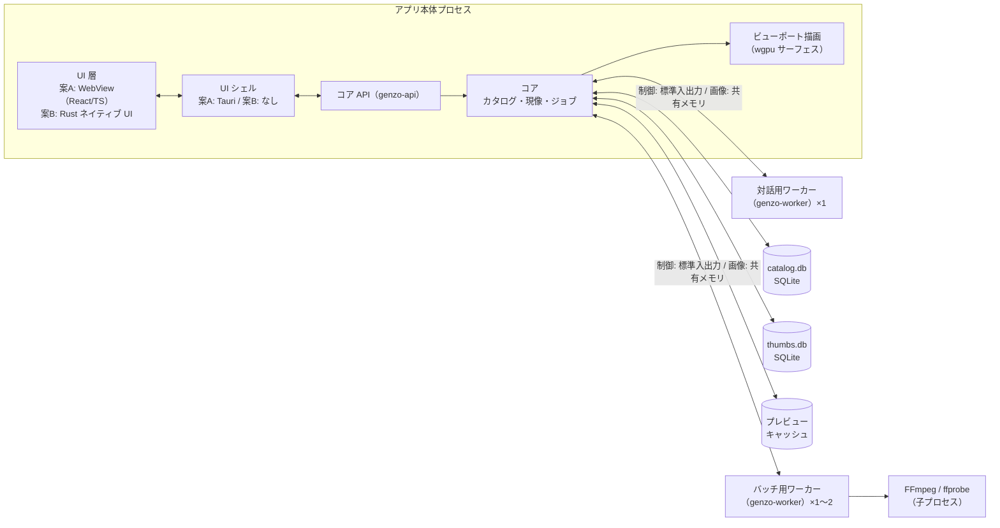
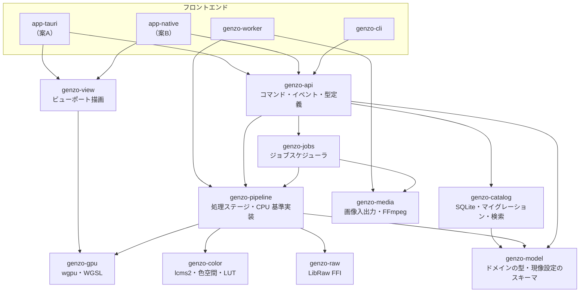
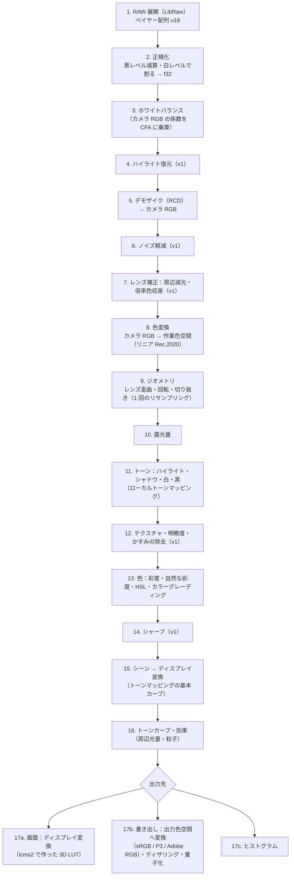
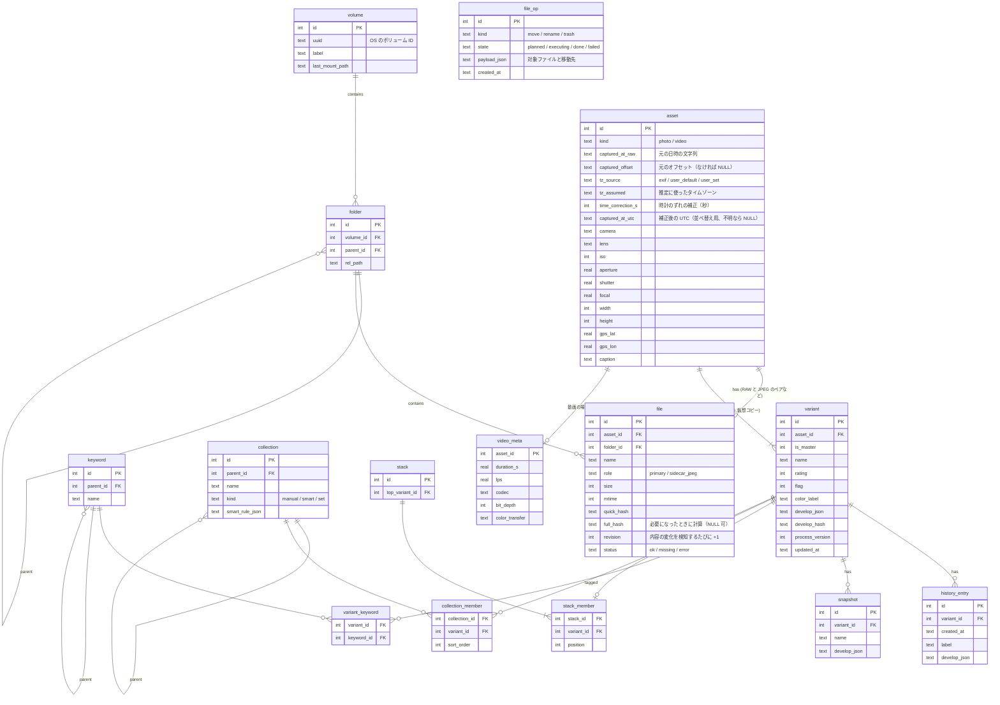
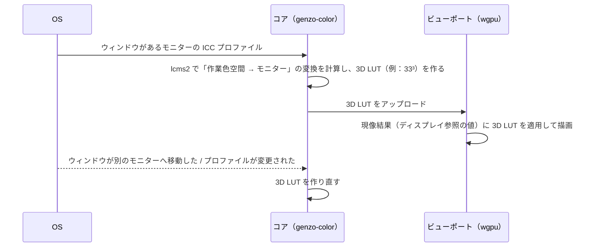
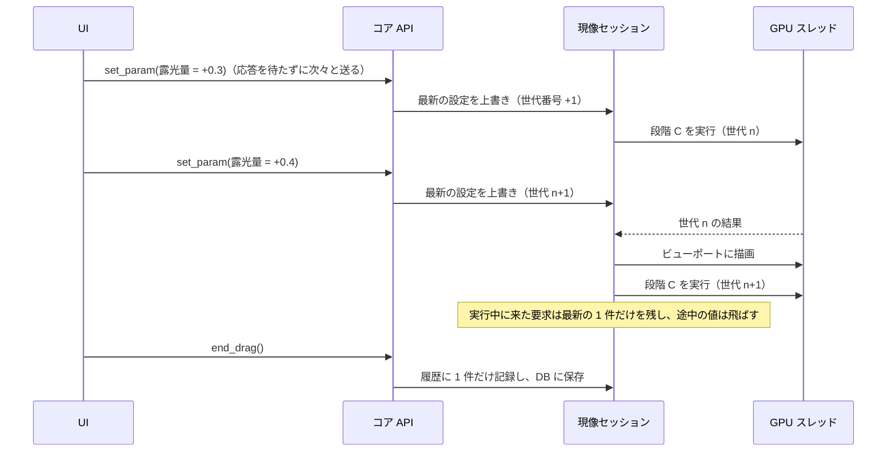
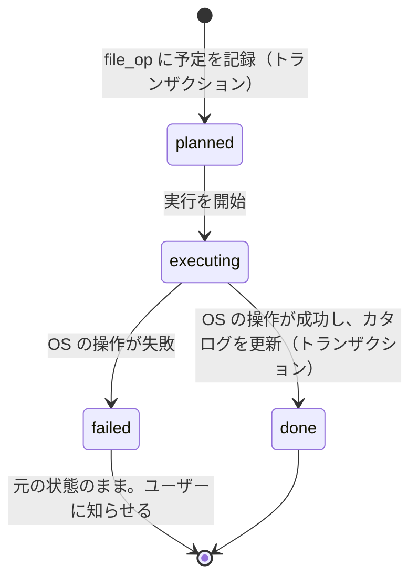

# [4] アーキテクチャ設計

- 入力: `docs/01`〜`docs/03`、`docs/decision_log.md`
- 前提とする技術スタック: **Rust コア ＋ wgpu ＋ SQLite ＋ LibRaw ＋ lcms2 ＋ FFmpeg（子プロセス）**。UI は案 A（Tauri 2 ＋ React / TypeScript）を第 1 候補とし、PoC-1 の結果で案 B（Rust ネイティブ UI）に切り替えられるようにする。
- 位置づけ: たたき台。コード例は設計を説明するためのもので、そのままではコンパイルできない箇所があります。

---

## 1. 全体構成

### 1.1 設計の基本方針

1. **コアは UI を知らない**: 現像エンジン・カタログ・ジョブ管理は、UI から独立した Rust のライブラリ群（crate）として作る。UI は「コア API」（コマンドとイベント）だけを通じてコアを使う。これにより、案 A と案 B を切り替えても、コアはそのまま使える（MAINT-01）。
2. **CPU 版が正、GPU 版は高速化**: すべての現像処理は CPU 版（Rust）を基準実装とし、GPU 版（WGSL）は CPU 版との差が許容誤差以内であることをテストで確認する（MAINT-02、IQ-07a。完全な一致は保証できない）。
3. **シーンリニアで処理し、最後にディスプレイ向けへ変換する**: 色の処理は、光の量に比例した値（シーンリニア）のまま浮動小数点で行い、トーンマッピングでディスプレイ向けの値に変換する（IQ-01、IQ-02）。
4. **信頼できない入力は隔離する**: 写真・動画の解析とデコードは、**対話的な処理も含めてすべて** 別プロセスのワーカーで実行する。壊れたファイルでデコーダが異常終了しても、アプリ本体は落ちない（SEC-05）。本体は、ワーカーから受け取って検証したバッファだけを扱う。
5. **パラメータは解像度に依存させない**: 半径などの空間的なパラメータは「画像サイズに対する割合」で定義する。これにより、縮小プレビューと等倍表示・書き出しの見た目の差を小さくする（差は IQ-07b の許容差で管理する）。

### 1.2 プロセス構成



| プロセス | 役割 | 理由 |
|---|---|---|
| アプリ本体 | UI、コア API、**GPU を使う処理のすべて**（現像・ビューポート描画・書き出しの現像処理）、JPEG などのエンコード、カタログへの書き込み | GPU のキューとメモリを 1 か所で管理し、優先度を制御するため（レビュー R-10）。本体が扱うのは、ワーカーが展開して本体が検証したバッファだけにする |
| 対話用ワーカー（1 個） | ルーペ・現像パネルで開く写真の **RAW の展開とデコード**（優先度が最も高い処理専用で、常に待機させておく） | 対話的な処理でも、信頼できない入力のデコードは本体で行わない（SEC-05。レビュー R-05）。常駐させておくことで、プロセス起動の待ち時間をなくす |
| バッチ用ワーカー（1〜2 個） | 取り込み時のメタデータ読み取り、埋め込みサムネイル抽出、プレビュー生成と書き出しのための RAW の展開 | 大量の未知のファイルを扱う処理を隔離する |
| FFmpeg / ffprobe | 動画のメタデータ取得、サムネイル生成 | 動画デコーダの異常を隔離する。ライセンス上も扱いやすい |

ワーカーはカタログ DB に直接書き込まず、結果を本体に返します。DB に書き込むのは本体だけにして、書き込みの競合を避けます。

**ワーカーとのやり取り（レビュー R-05, R-10）**
- 制御（ジョブの依頼・結果・キャンセル）は、標準入出力で 1 行 1 メッセージの JSON をやり取りします。
- 画像のデータ（展開した CFA など。α7 IV で約 65MB）は **共有メモリ** で渡します。共有メモリは **本体が確保して所有** し、ワーカーは書き込むだけです。ワーカーが異常終了しても、本体が回収します。
- 本体は、受け取ったバッファの寸法・長さ・型・上限（画素数の上限など）を検証してから使います。
- ジョブごとにタイムアウトを設けます（ハングへの対策）。タイムアウトしたら、ワーカーを強制終了して再起動します。同じファイルで 2 回続けて失敗した場合は、そのファイルを以後スキップします。
- ワーカーごとにメモリの上限を設けます（OS の機能で設定できるかは PoC-2 で確認）。

### 1.3 スレッド構成（アプリ本体）

| スレッド | 役割 |
|---|---|
| UI スレッド | UI シェルのイベントループ（案 A では Tauri のメインスレッド） |
| コマンド処理（tokio の非同期ランタイム） | UI からのコマンドを受け付け、各サービスに振り分ける |
| GPU スレッド（1 本） | wgpu のデバイスとキューを専有し、現像とビューポート描画のコマンドを順番に実行する |
| DB 書き込みスレッド（1 本） | SQLite への書き込みをすべてここに集める。書き込みはトランザクションでまとめる |
| DB 読み取りプール（数本） | 検索・一覧の読み取り。WAL モードなので、書き込みと並行して読める |
| CPU ワーカープール（rayon） | CPU 版の現像処理、JPEG のエンコードなど（RAW の展開はワーカープロセスで行う）。並列度は、CPU のコア数と **メモリの予算**（6.1 節）の両方で制限する |
| ジョブスケジューラ | 優先度付きのジョブキューを管理する（6 章） |

### 1.4 モジュール（crate）の構成



- 依存の方向は常に上から下です。`genzo-model` は他のどの crate にも依存しません。
- `genzo-gpu` は `genzo-pipeline` が定義する処理ステージの GPU 版です。GPU のない環境（CI）では、`genzo-pipeline` の CPU 版だけで動きます。
- `genzo-cli` は、UI なしで登録・検索・現像・書き出しを行えます。自動テストと、AI による動作確認に使います（ORG-05）。

### 1.5 UI とコアの間のインターフェース

| 種類 | 方向 | 内容 | 案 A での実現方法 | 案 B での実現方法 |
|---|---|---|---|---|
| コマンド | UI → コア | 「フィルターを適用」「レーティングを 3 にする」「露光量を +0.5 にする」など。要求と応答の組 | Tauri のコマンド（JSON） | 関数を直接呼ぶ |
| イベント | コア → UI | 「ジョブの進捗」「カタログが変更された」「プレビューが更新された」 | Tauri のイベント | チャネル |
| サムネイル | コア → UI | グリッドに表示する画像 | カスタム URI スキーム `genzo://thumb/{variant_id}?rev={hash}`（ブラウザのキャッシュが効く） | テクスチャを直接渡す |
| 現像画像 | コア → 画面 | ルーペ・現像のプレビュー | **WebView を通さず、ビューポート（wgpu サーフェス）に直接描画** | 同左 |

- コマンドとイベントの型は Rust 側で定義し、TypeScript の型を自動生成します（ts-rs や specta など）。型の不一致をコンパイル時に検出でき、AI による変更の誤りを防げます。
- 現像のスライダー操作は、コマンドの応答を待たずに次の値を送れるようにします。コア側では、古い要求を捨てて最新の値だけを処理します（6.2 節）。

---

## 2. 現像パイプライン

### 2.1 処理ステージ



| 区間 | ステージ | 色空間 | 数値の範囲 | 精度 |
|---|---|---|---|---|
| センサー | 1〜4 | カメラ RGB（CFA） | 0〜1 を基本とし、WB 後は 1 を超えうる | u16 → f32 |
| シーンリニア（カメラ） | 5〜7 | カメラ RGB | 0〜（上限なし） | f32 |
| シーンリニア（作業） | 8〜14 | リニア Rec.2020 | 0〜（上限なし）。負の値は色域外として保持する | f32 |
| ディスプレイ参照 | 15〜16 | リニア Rec.2020（D65）。ディスプレイの白を 1 とする相対値。トーンカーブの計算のときだけ一時的に符号化する（2.6 節） | 輝度は 0〜1。色域外（負の値）は保持する | f32 |
| 出力 | 17 | ディスプレイ / 出力の色空間（色域圧縮と符号化をここで行う） | 0〜1 | 画面：16bit 浮動小数点または 10bit ／ 書き出し：8bit・16bit |

各境界の色空間・白色点・伝達関数・値の範囲の厳密な定義は、**2.6 節（色の契約）** を正とします。

**補足**
- **ステージ 3**: ホワイトバランスはデモザイクの前に CFA へ適用します。ユーザーが指定する色温度・色かぶりの値は、カメラ行列を使ってカメラ RGB の係数に変換します。
- **ステージ 9**: レンズの歪曲補正・回転・切り抜きは、座標の変換としてまとめ、リサンプリングを 1 回だけ行います。複数回行うと画質が落ちるためです。この段階より後の処理は、切り抜いた範囲だけを計算します。
- **ステージ 11, 12**: ローカルトーンマッピングとかすみの除去は、画像全体の情報（低周波成分）を使います。そのため、**縮小した画像から「ガイド」（ぼかした輝度など）を先に計算し、タイル処理のときにはそれを拡大して参照** します。これにより、縮小プレビューとフル解像度の結果の差を小さくします（一致を保証するものではなく、IQ-07b の許容差で管理します）。ガイドの依存関係と座標系は 2.7 節で定義します。
- **ステージ 13**: 彩度や色相の調整は、リニアな値から知覚的に均等な色空間（OKLab など。どれを使うかは PoC で決定）に変換して行い、リニアに戻します。
- **ステージ 15**: シーンリニアの値（1 を超えうる）を、ディスプレイの表示範囲（0〜1）に滑らかに収める基本カーブです。白飛びを自然に丸めます。HDR 表示（CLR-03）に対応するときは、このステージを差し替えます。
- **ステージ 16**: トーンカーブは、ディスプレイ参照の値に対して適用します。カーブの横軸と縦軸は、輝度を **sRGB の伝達関数（IEC 61966-2-1）で符号化した値** とします（2.6 節）。ユーザーが見ている明るさとカーブの横軸が対応するため、操作が直感的になります。色相がずれないよう、輝度に対して適用し、RGB の比率を保ちます（RGB チャンネル別のカーブは例外）。
- **ローカル補正（マスク、v1）**: マスクごとに「露光量 +0.3、彩度 −10」のような調整値の差分を持ちます。ステージ 10〜14 の処理を、マスクの値で重み付けして適用します。Lightroom と同様の考え方です。

### 2.2 プレビューの計算方法と中間キャッシュ

スライダー操作に 33ms 以内で追従する（PERF-01）ため、処理をいくつかの段階に分け、段階の境目で結果をキャッシュします。

| 段階 | 含むステージ | 実行のタイミング | キャッシュ（α7 IV の場合） |
|---|---|---|---|
| **段階 A0：RAW の展開** | 1 | 写真を開いたとき（対話用ワーカーで実行） | 展開した CFA（u16、フル解像度）を、開いている写真について本体のメモリに保持する（有効画素だけで約 65MB。実際のバッファの寸法・余白を含めた量は PoC-2 で計測する） |
| **段階 A1：センサー処理** | 2〜8 | 写真を開いたとき、または WB・ノイズ軽減・レンズ補正・カメラプロファイルを変更したとき | **プレビュー解像度（長辺 2560px）に縮小した作業色空間の画像** を GPU 上に保持する（2560 × 1707 ≒ 4.37M 画素 × 16 バイト ≒ 70MB） |
| **段階 B：ガイドの計算** | 11, 12 のガイド | 2.7 節の依存関係のとおり | 長辺 512px 程度の低解像度の画像 |
| **段階 C：仕上げ** | 9〜17 | スライダーを操作するたび | なし（毎回計算する） |

- 露光量やトーンカーブのような段階 C のパラメータを変更したときは、**段階 C だけを再計算** します（約 4.37M 画素の処理）。
- **WB を変更したとき**（レビュー R-04）: RAW の展開（A0）はやり直さず、保持している CFA から段階 A1 を実行します。
  - ドラッグ中は、デモザイクの代わりに **2 × 2 の画素をまとめる簡易処理**（ベイヤー配列の 4 画素から 1 画素の RGB を作る。α7 IV なら 3504 × 2336）で計算し、長辺 2560px に縮小します。デモザイクより大幅に軽く、表示に必要な解像度は満たします。
  - 指を離したら、デモザイク（RCD）で計算し直します（PERF-01b）。
  - 簡易処理と最終品質の見た目の差は IQ-07b の対象外とし、指を離した後の描画で置き換わることを前提にします。
- **等倍表示・書き出し**: フル解像度を **タイル**（例：1024 × 1024 ＋ 周辺の余白）に分けて段階 A1〜C を実行します。段階 B のガイドは、プレビューと同じものを使います（2.7 節）。

各段階のキャッシュのキーは 4.1 節の共通の規則に従います。キーが一致すれば再計算を省略します。

### 2.3 CPU 版と GPU 版の一致を保証する方法

- 浮動小数点は 32bit で統一します。GPU でも「高速だが不正確な演算」の最適化は使いません。
- 合計や平均を求める処理（ヒストグラム、ガイドの計算など）は、計算の順序で結果が変わるため、CPU 版と GPU 版で同じ分割と同じ順序で計算します。
- 3D LUT の補間や、テクスチャのサンプリングは、GPU のハードウェア補間に頼らず、自前で補間します（ハードウェア補間は精度が GPU によって異なるため）。
- テスト（MAINT-03）：基準画像のセットで、CPU 版と GPU 版の両方で処理し、差が許容誤差（IQ-07a）以内であることを確認します。GPU のない CI では CPU 版の回帰テストだけを行い、GPU 版の比較は開発者の PC（RTX 3080 と M1）で定期的に実行し、**リリース前には必ず実行** します（レビュー R-08）。
- WGSL は浮動小数点の演算の結合や融合を許しているため、上の工夫をしても **完全な一致は保証できません**。ステージごとに許容誤差を定め、NaN・無限大・負の値・ゼロ付近の値の扱い（たとえば、対数を取る前に小さな値で下限を設ける）を CPU 版と GPU 版でそろえます。

### 2.4 書き出しの経路

- 書き出しは、**GPU 版を既定** とします（PERF-10 の 3 秒以内を満たすため）。GPU が使えない環境やエラーの場合は、CPU 版に切り替えます。
- 書き出しの GPU 処理は **本体の GPU スレッドで、優先度 P3 のタイルとして実行** します（6.1 節）。バッチ用ワーカーは RAW の展開だけを担当します。
- プレビュー（縮小してから処理）と書き出し（フル解像度で処理してから縮小）は、処理の順序が異なるため、結果は一般に一致しません。両者の差は IQ-07b の許容差で管理し、テストで確認します（レビュー R-02）。
- 書き出したファイルの安全性（原本を上書きしない、途中で失敗しても不完全なファイルを残さない）は 6.4 節で定義します。

### 2.5 現像設定のスキーマとバージョン管理

```rust
/// 1 つのバリアント（仮想コピーを含む）の現像設定。
/// カタログには JSON で保存する。
#[derive(Serialize, Deserialize, Clone, PartialEq)]
pub struct DevelopSettings {
    /// スキーマの形（項目の追加・名前の変更）のバージョン。
    pub schema_version: u32,
    /// 処理アルゴリズムのバージョン。値が同じなら、アプリを更新しても結果は変わらない（IQ-08）。
    pub process_version: u32,
    pub white_balance: WhiteBalance,
    pub exposure_ev: f32,             // -5.0 〜 +5.0
    pub tone: ToneParams,             // ハイライト・シャドウ・白・黒（-100 〜 +100）
    pub tone_curve: ToneCurve,
    pub color: ColorParams,           // 彩度・自然な彩度・HSL・カラーグレーディング
    pub geometry: Geometry,           // 切り抜き・回転
    pub lens: LensCorrection,
    pub detail: DetailParams,         // シャープ・ノイズ軽減
    pub masks: Vec<LocalAdjustment>,  // v1
    /// 現像結果に影響する外部データの識別子と内容のハッシュ（レビュー R-08）。
    pub render_deps: RenderDeps,
}

/// 結果に影響する外部データ。値が変わったら、同じ設定でも結果が変わりうる。
pub struct RenderDeps {
    pub camera_profile: DataRef,         // カメラ行列・プロファイル
    pub lens_profile: Option<DataRef>,   // レンズ補正のデータ
    pub raw_decoder: String,             // 例: "libraw-0.21.x"（展開の設定を含む）
}
pub struct DataRef { pub id: String, pub sha256: String }

pub enum WhiteBalance {
    AsShot,
    Preset(WbPreset),
    Custom { temperature_k: f32, tint: f32 },
}
```

- **schema_version**: 設定の形が変わったときに上げます。古い形式の JSON を読み込んだときは、マイグレーション関数で順番に新しい形式へ変換します。
- **process_version**: アルゴリズムを変更し、同じ設定でも結果が変わる場合に上げます。既存の写真は古い `process_version` のまま、古いアルゴリズムで処理します。新しいアルゴリズムは、ユーザーが明示的に更新した写真にだけ適用します（DATA-09）。
  - そのため、処理ステージのコードは、**処理バージョンごとにアルゴリズムを切り替えられる** ように作ります（ステージは `StageContext` から `process_version` を受け取る。7.1 節）。古いアルゴリズムのコードは削除せず、回帰テストの対象として残します。
- **render_deps**（レビュー R-08）: アルゴリズムを固定しても、カメラ行列・レンズのデータ・RAW デコーダが変われば結果は変わりえます。
  - カメラ行列などのデータは、LibRaw が内蔵する表に頼らず、**対象機種（α7 IV / α7C）の値をアプリ側にデータファイルとして持ち**、ID とハッシュで参照します。LibRaw を更新しても色が変わらないようにするためです。
  - 各 `process_version` が、どのデータと、どの RAW デコーダの設定を使うかを処理仕様として固定します。
  - 依存を更新したときは、旧設定の回帰画像を比較し、差が出た場合は新しい `process_version` として扱います。

### 2.6 色の契約（各境界の定義。レビュー R-01）

パイプラインの各境界で、画像の値が何を意味するかを次のとおり固定します。実装はこの表を正とし、他の節の記述と食い違う場合はこの表に合わせます。

| 境界 | 位置 | 原色 | 白色点 | 伝達関数 | 値の範囲 |
|---|---|---|---|---|---|
| B0：CFA | ステージ 2 の出力 | カメラのセンサー（チャンネルごと） | — | リニア | 黒レベルを 0、白レベルを 1 とする。白レベルを超えた（飽和した）画素には印を付ける |
| B1：カメラ RGB | ステージ 3〜7 | カメラのセンサー | WB の係数で、被写体の中立色が (1, 1, 1) になるように正規化する | リニア | 0 以上、上限なし |
| B2：作業色空間 | ステージ 8〜14 | ITU-R BT.2020 | D65 | リニア | 上限なし。負の値（色域外）を保持する |
| B3：ディスプレイ参照 | ステージ 15 の出力〜16 | ITU-R BT.2020 | D65 | リニア（ディスプレイの白を 1 とする相対値） | 輝度は 0〜1。負の値（色域外）を保持する |
| B4a：画面への出力 | ステージ 17a | モニターの ICC プロファイル | モニターの ICC プロファイル | モニターの ICC プロファイル | 0〜1 |
| B4b：書き出し | ステージ 17b | sRGB / Display P3 / Adobe RGB (1998) | D65 | sRGB と Display P3 は IEC 61966-2-1 の伝達関数、Adobe RGB はガンマ 563/256（≒ 2.2） | 0〜1 を 8bit / 16bit に量子化する |
| B5：キャッシュ（L0 / L1） | 4 章 | Display P3 | D65 | IEC 61966-2-1 の伝達関数 | 0〜1 を 8bit JPEG で保存し、ICC プロファイルを埋め込む |

- アルファチャンネルは使いません。マスクは別の 1 チャンネルの画像として扱います。
- NaN・無限大は各ステージの出力で検出し、0 に置き換えます（デバッグ用のビルドでは件数を記録します）。

**3 つの圧縮・変換を分ける**
1. **トーンの圧縮**（ステージ 15）: 1 を超える輝度を、0〜1 に滑らかに収める。色域外の値には触れない。
2. **色域の圧縮**（ステージ 17 の最初）: 出力先（モニター、または書き出しの色空間）の色域外の色を、色相を保ちながら色域内に収める。単純な切り捨ては使わない。方式は PoC-4 で選ぶ。
3. **符号化**（ステージ 17 の最後）: 出力先の伝達関数で符号化する。

**トーンカーブ（ステージ 16）の計算方法**
- B3 の輝度 Y（BT.2020 の係数で計算）を、IEC 61966-2-1 の伝達関数で符号化する → カーブを適用する → リニアに戻す → RGB に「新しい Y ÷ 元の Y」の比率を掛ける（色相を保つ）。
- RGB チャンネル別のカーブは、各チャンネルを同じ伝達関数で符号化して適用する。
- ステージ 16 の出力は B3 のまま（リニア）です。「約 2.2」のような近似の符号化は使いません。

**画面への出力（ステージ 17a）**
1. B3 → モニターの色域へ色域圧縮する。
2. 3D LUT の入力として使うため、IEC 61966-2-1 の伝達関数で符号化する（リニアのまま LUT を引くと、暗部の精度が落ちるため）。
3. 3D LUT（33³、四面体補間を自前で実装）を適用する。LUT は lcms2 で、変換元「BT.2020 の原色・D65・IEC 61966-2-1 の伝達関数」のプロファイル → 変換先「モニターの ICC プロファイル」、レンダリングインテントは相対的な色域を維持（色域圧縮は 1. で済んでいるため）として作る。
- キャッシュ（B5）を表示するときは、変換元を Display P3 とした別の LUT を同じ仕組みで使います。

**RAW 以外の入力（JPEG / TIFF / PNG / HEIC）**
- 埋め込みの ICC プロファイル（なければ sRGB とみなす）から、lcms2 で B2 に変換し、ステージ 1〜8 を飛ばします。

**カメラ RGB から作業色空間への変換（ステージ 8）**
- 方針: 「XYZ（D65）→ カメラ RGB」の行列から、作業色空間（BT.2020）→ カメラ RGB の行列を作り、中立色 (1, 1, 1) が (1, 1, 1) に対応するよう行ごとに正規化してから、逆行列で カメラ RGB → BT.2020 の変換を得る。WB で中立色を正規化しているため、撮影時の光源の白は D65 の白に対応する（カメラ RGB の空間での簡易的な色順応）。
- 光源が D65 から離れるほど、この方式の誤差は大きくなります。光源ごとに補間する DCP 方式のプロファイル（DEV-17、v1）で改善します。
- LibRaw には複数の行列（`cam_xyz`、`rgb_cam` など）があり、意味が異なります。どれを使うか、また行列の基準の光源は、**PoC-2 で実際の API と α7 IV / α7C のデータで確認** します。使う行列はアプリ側のデータファイルに固定します（2.5 節の render_deps）。

### 2.7 ガイドの依存関係と座標系（レビュー R-03）

**座標系**

| 名前 | 内容 |
|---|---|
| S：センサー座標 | CFA の画素の座標（フル解像度） |
| G：ジオメトリ補正後の全体 | レンズの歪曲補正と回転を適用した、**切り抜く前** の画像全体。座標は、G の外接矩形の長辺を 1 とした値で表す |
| C：出力座標 | 切り抜いた後の画像。出力の画素は C → G（切り抜きの位置と倍率）→ S（回転と歪曲補正の逆変換）の順にたどる |

**ガイドの定義**
- 入力: ステージ 8 の出力（B2、**露光量を適用する前**）の輝度 Y を、G の座標で長辺 512px に縮小したもの。**切り抜く前の画像全体** を使う。
- 値: log2(max(Y, 2⁻¹⁶)) をぼかしたもの。
- 露光量は値を定数倍する処理なので、対数の領域では定数を足すだけになります。そのため、**露光量を変えてもガイドを作り直す必要はなく**、使うときに露光量（EV）を足します。

**ガイドが依存するもの（キャッシュのキーに含めるもの）**

| 含める | 含めない |
|---|---|
| 段階 A1 のキー（WB、レンズ補正、カメラプロファイル、ノイズ軽減）、回転、歪曲補正、ガイドのアルゴリズムのパラメータ、process_version | 露光量（上記のとおり対数の領域で足す）、切り抜き、ハイライト・シャドウなどのスライダー（ガイドを使う側のパラメータ） |

**決めごと**
- **切り抜きによって補正の結果は変わらない**: ガイドとかすみの除去（v1）に使う全体の統計は、切り抜く前の画像全体（G）から計算します。
- **空間的なパラメータ**（ぼかしの半径など）は、G の長辺に対する割合で定義します。出力の解像度や切り抜きには依存しません。

**タイル処理**
- 各タイルの周辺の余白は、ステージごとの `input_roi`（7.1 節）を出力側から順にたどって計算します。近傍の画素を使う処理の半径、リサンプリングのフィルタの範囲、デモザイクに必要な余白を含みます。
- 画像の端の外側は、**鏡映（反射）で拡張** します。CPU 版と GPU 版で同じ方法を使います。
- 確認方法: タイルの大きさを 256 / 512 / 1024 と変え、タイルに分けない処理の結果と比べ、IQ-07a の許容差以内であることを自動でテストします。露光量だけを変えたときにガイドが再計算されないこと、切り抜きを変えても切り抜いた範囲内の結果が変わらないこともテストします。

---

## 3. カタログ

### 3.1 ER 図



**設計上の判断**
- **asset（実体）と variant（現像のバリエーション）を分ける**: 1 つの元ファイルから複数の仕上がり（仮想コピー）を作れるようにするためです。グリッドに表示する単位は variant とし、レーティング・フラグ・キーワード・コレクションも variant に付けます（Lightroom の仮想コピーと同じ扱い）。
- **写真と動画を同じ asset テーブルで扱う**: `kind` で区別します。動画に固有の情報は `video_meta` に分けます。これにより、写真と動画を混ぜた一覧・検索（ORG-01）が自然に実現できます。
- **現像設定は JSON で 1 列に保存する**: 項目が多く、バージョンによって変わるためです。検索に使う一部の値（`process_version` など）だけを列として持ちます。
- **撮影日時は、元の値と推定に使った情報を分けて持つ**（レビュー R-18）: 元の日時の文字列、元のオフセットの有無、推定に使ったタイムゾーンとその出どころ、時計のずれの補正値、補正後の UTC を別々に保存します。後から時計のずれやタイムゾーンを修正（LIB-16）したり、修正を取り消したりできるようにするためです。
  - オフセットの情報がない写真・動画は、ユーザーが設定した既定のタイムゾーンで UTC を推定し、`tz_source = user_default` と記録します。
  - 撮影日時がないファイルは、現在時刻などで置き換えず `captured_at_utc = NULL` とし、撮影日時順の並べ替えでは **最後に並べます**。
- **全文検索**: ファイル名・キャプションを対象にします。日本語の検索の仕様は 3.6 節で定義します。

### 3.2 主要なクエリとインデックス

| 用途 | クエリの概要 | インデックス |
|---|---|---|
| グリッドの一覧（撮影日時順） | フィルター条件に合う variant の id を、撮影日時順に **すべて** 取得する。同じ日時のものは `variant.id` の順に並べる（レビュー R-12） | `asset(captured_at_utc)`、`variant(asset_id)` |
| 評価での絞り込み | `rating >= ?` と期間 | `variant(rating)` と `asset(captured_at_utc)`。PoC-6 で実行計画を確認する |
| フォルダの表示 | フォルダ内の variant | `file(folder_id)` |
| キーワードでの検索 | 子のキーワードを含めて検索する（再帰 CTE） | `variant_keyword(keyword_id, variant_id)` |
| テキスト検索 | 3.6 節 | FTS5（trigram）と、正規化した文字列の列 |
| カメラ・レンズでの絞り込み | — | `asset(camera)`、`asset(lens)` |

**グリッドの仮想スクロールの方式**: フィルターを適用したとき、条件に合う variant の id を順番どおりに **すべて**（50 万件でも約 4MB）取得して、コアのメモリに保持します。UI は「表示範囲の何番目から何番目」を要求し、コアはその範囲の詳細（評価、ファイル名など）だけを返します。これにより、スクロール位置に関係なく一定の速さで表示できます。

### 3.3 ファイルの移動・リネーム・欠落への対応

- ファイルの場所は「ボリューム ＋ ボリューム内の相対パス」で管理します。ドライブ文字やマウント先が変わっても追跡できます（FILE-03）。
- **クイックハッシュ**（ファイルサイズ ＋ 先頭と末尾の 64KB のハッシュ）は、**候補を絞り込むためだけ** に使います。ファイルの中間だけが変わった場合を見分けられないためです（レビュー R-09）。
- 同一性を確定する必要がある場面（再リンクの確定、コピー取り込みの検証）では、**ファイル全体のハッシュ**（BLAKE3 などの高速なもの）で確認し、`file.full_hash` に保存します。
- ファイルの変化（サイズ・更新日時・クイックハッシュのいずれかの変化）を検知したら `file.revision` を 1 増やし、キャッシュを無効にします（4.1 節）。
- 起動時にすべてのファイルの存在を確認すると時間がかかるため、**表示したときに確認** し、加えてバックグラウンドで少しずつ確認します。見つからないファイルは `status = missing` にし、グリッドに印を付けます。
- 再リンク（FILE-04）では、ユーザーが指定したフォルダからクイックハッシュが一致するファイルを候補として探し、全体のハッシュで確認してから結び付け直します。
- アプリ内での移動・リネーム（FILE-02）とゴミ箱への移動は、`file_op` テーブルを使った状態遷移で行います（6.4 節）。

### 3.4 データ保全

- **カタログ（catalog.db）**: WAL モード、`synchronous = FULL` を出発点にします。macOS では `fullfsync` も有効にします（macOS の通常の fsync は、ストレージ装置のキャッシュまで書き込まない場合があるため）。保存の待ち時間を PoC-6 で計測し、問題がなければこのまま採用します（DATA-03b。レビュー R-07）。
  - `synchronous = NORMAL` を採用する場合は、電源断で失ってよい操作の範囲とその根拠を決定事項ログに記録します。
  - スライダー操作の保存はまとめて行う（6.2 節）ので、FULL による書き込みの回数の増加は限られる見込みです。
- **サムネイル DB（thumbs.db）**: 失っても作り直せるため、`synchronous = NORMAL` とします。
- すべての接続で `PRAGMA foreign_keys = ON` を設定します（SQLite の既定では外部キーの制約が無効なため）。
- バックアップは SQLite のオンラインバックアップ API（または `VACUUM INTO`）で、アプリを使いながら一貫性のあるコピーを作ります（DATA-04）。
- スキーマの変更は、番号付きのマイグレーションで行い、適用前に自動でバックアップします（DATA-08）。

### 3.5 カタログの制約（レビュー R-12）

ER 図に加えて、MVP の時点で次の制約を DDL に定義します。v1 以降のテーブルは、必要になったときにマイグレーションで追加します。

| 対象 | 制約 | 理由 |
|---|---|---|
| `folder` | `UNIQUE(volume_id, rel_path_key)` | 同じフォルダの二重登録を防ぐ |
| `file` | `UNIQUE(folder_id, name_key)` | 同じファイルの二重登録を防ぐ（**登録の繰り返しは冪等** にする） |
| `variant` | `asset_id` ごとに `is_master = 1` は 1 件だけ（部分インデックスによる UNIQUE） | マスターが 2 つになるのを防ぐ |
| `variant` | `rating` は 0〜5、`flag` は -1 / 0 / 1（CHECK） | 不正な値を防ぐ |
| 外部キー | asset を削除したら、file・variant・履歴・キーワードの関連を削除する（ON DELETE CASCADE）。キーワードやコレクション自体は残す | 参照の整合性 |

- **パスの比較用のキー**（`rel_path_key`、`name_key`）は、Unicode の正規化（NFC）を行い、Windows と macOS の既定のファイルシステムでは大文字・小文字を区別しない形にしたものです。表示には元のパスを使います。
- フォルダを走査するとき、**シンボリックリンクやジャンクションの先のフォルダはたどりません**（循環と二重登録を防ぐため）。
- 高度な重複検出（IMP-04、v1）とは別に、MVP でも「同じファイルを登録し直しても件数が増えない」ことを保証します。

### 3.6 テキスト検索の仕様（レビュー R-11）

| 項目 | MVP の仕様 |
|---|---|
| 対象 | ファイル名、キャプション |
| 一致の方式 | **部分一致**（「京都」で「京都旅行」も見つかる） |
| 正規化 | 検索する側とされる側の両方を、Unicode の NFKC 正規化と小文字化で正規化する（全角・半角の英数字、英字の大文字・小文字を区別しない）。濁点の有無は区別する |
| 3 文字以上の検索語 | FTS5 の **trigram トークナイザー** で検索する |
| 1〜2 文字の検索語 | trigram では検索できないため、正規化した文字列の列に対する部分一致（LIKE）で検索する。50 万件での速度を PoC-6 で計測する |
| キーワード | 全文検索ではなく、キーワードのテーブル（3.2 節）で完全一致・前方一致を検索する |
| 入力の扱い | ユーザーの入力を FTS5 の検索式としてそのまま実行しない。検索語を引用符で囲むなどしてエスケープし、検索式を組み立てる |

- 形態素解析による単語単位の検索は、trigram で不足が出た場合に v1 以降で検討します。
- 使う SQLite のビルドで trigram トークナイザーが使えることと、索引のサイズを PoC-6 で確認します。

### 3.7 検索結果の世代と、検索中の更新（レビュー R-12）

- フィルターを適用するたびに、検索結果に **世代番号** を付けます。UI が範囲を要求するときは世代番号を添え、古い世代への要求には「結果が更新された」と応答します。
- 評価の変更などで、表示中の検索結果の条件や並び順が変わる場合は、バックグラウンドで結果を作り直し、新しい世代として UI に知らせます。
  - 作り直した後も、**選択中の variant は id で追跡して選択を保ちます**。
  - 「★3 以上」で表示中に評価を 2 に下げた写真は、すぐに一覧から消すと操作しにくいため、次にフィルターを適用し直すまで残します（Lightroom と同様の挙動。UI の詳細は M4 で決める）。

---

## 4. プレビュー・サムネイルのキャッシュ

| 階層 | 解像度 | 形式 | 保存場所 | 保持の方針 |
|---|---|---|---|---|
| L0：サムネイル | 長辺 320px | JPEG（品質 80 前後） | `thumbs.db`（SQLite の BLOB） | 全件を保持する（50 万件で 10〜15GB の見込み。SCL-03） |
| L1：標準プレビュー | 長辺 2560px | JPEG（品質 85 前後） | ファイル（`previews/ab/cd/{キャッシュキーのハッシュ}.jpg` のように分散） | 上限容量（既定 20GB）の LRU（SCL-04） |
| L2：等倍 | フル解像度 | 保存しない | — | 表示中の写真だけをタイルとしてメモリに保持する |

- **L0 を SQLite に保存する理由**: 50 万個の小さなファイルを作ると、ファイルシステムの操作（作成・削除・ウイルス対策ソフトのスキャン）が遅くなるためです。小さなデータは SQLite に入れた方が速い場合が多いとされています（PoC-6 で確認）。
- **カタログと別の DB にする理由**: サムネイルの DB は消えても作り直せるデータなので、カタログのバックアップに含めないためです。
- **色空間**: キャッシュは **Display P3** で保存し、表示するときにディスプレイ変換（3D LUT）をかけます。モニターを変えてもキャッシュを作り直す必要がありません。
- **無効化**: キャッシュはキャッシュキー（4.1 節）で識別します。設定や入力が変わるとキーが変わるので、古いキャッシュは使われなくなり、LRU（L1）または回収のジョブ（L0）で削除されます。
- **最初の表示**: 取り込み直後は、RAW に埋め込まれた JPEG を L0 / L1 の代わりに使い（PRV-01）、バックグラウンドで現像結果に置き換えます。埋め込み JPEG と、RAW 以外の元の JPEG は、ICC プロファイルと向き（Orientation）を反映してから B5（2.6 節）に変換して保存します。

### 4.1 キャッシュのキー・公開・回収（レビュー R-09）

**キャッシュキー**（段階 A1 / B の中間キャッシュ、L0、L1 で共通の規則）

```rust
pub struct CacheKey {
    pub file_id: i64,
    pub file_revision: u32,      // 元ファイルの内容が変わったら +1（3.3 節）
    pub process_version: u32,
    pub render_deps_hash: [u8; 32], // カメラ行列・レンズデータ・デコーダ（2.5 節）
    pub develop_hash: [u8; 32],  // その段階までに影響する現像設定だけのハッシュ
    pub size: (u32, u32),        // 出力の寸法（または長辺）
    pub quality: RenderQuality,  // 簡易（ドラッグ中）/ 最終品質
    pub format: CacheFormat,     // 色空間（B5）・ファイル形式・形式のバージョン
}
```

**公開の順序**（生成の途中で終了しても、壊れたキャッシュを使わないため）
1. 一時ファイル（L1）または一時的な行（L0）に書き込む。
2. L1 は、同じフォルダ内でファイル名を変更して公開する（原子的な置き換え）。L0 は 1 つのトランザクションで置き換える。
3. 最後に、その variant の「現在のキャッシュキー」を更新する。

**古い世代の結果で上書きしない**
- 生成のジョブは、開始したときの現像設定の世代番号を持ちます。完了したときに、variant の現在の世代番号より古ければ、結果を捨てます（遅れて完了した古いジョブが、新しいキャッシュを上書きしないため）。

**回収**
- L1: 上限容量を超えたら、最後に使った日時が古いものから削除します。
- L0: variant を削除したとき、またはキャッシュキーが変わったときに古い行を削除します。サムネイル DB はカタログと別の DB なので外部キーは使えません。代わりに、アイドル時の回収ジョブで、存在しない variant の行を削除します。

---

## 5. ディスプレイの色管理



- アプリが自分で色変換を行うため、**OS による色変換が二重にかからない** ように、サーフェスの設定を確認する必要があります（macOS の CAMetalLayer の色空間設定、Windows のスワップチェーンの色空間）。具体的な設定方法は PoC-1 で確認します。
- グリッドのサムネイル（案 A では WebView 内の画像）は、ICC プロファイル付きの Display P3 の JPEG として配信します。WebView の色管理に任せることになるため、ビューポートほどの正確さは保証しません。ビューポートとの色の差の許容条件は、PoC-1 で決めます（レビュー R-17）。
- **HDR が有効な OS での表示**: MVP は SDR の表示だけに対応します。Windows で HDR（Advanced Color）が有効なモニターでも、SDR の画像として正しい明るさと色で表示されることを PoC-1 で確認します。

---

## 6. 並行処理とエラー処理

### 6.1 ジョブの優先度

| 優先度 | 例 | 方針 |
|---|---|---|
| P0：対話 | 現像中の写真のプレビュー更新、ルーペに表示中の写真 | 最優先。古い要求は捨てる（最新の 1 件だけを処理する） |
| P1：表示中 | グリッドの表示範囲のサムネイル | スクロールで表示範囲から外れたら取り消す |
| P2：先読み | ルーペで前後の写真、グリッドの少し先 | P0、P1 がないときに実行する |
| P3：バックグラウンド | プレビューの一括生成、書き出し、整合性チェック | 空いているときに実行する。進捗を表示し、キャンセルできる |

- すべてのジョブに **取り消しトークン** を持たせます。処理の区切り（タイルごと、ステージごと）で確認し、取り消されたら途中でやめます。
- **GPU への投入は本体の GPU スレッドだけが行います**（レビュー R-10）。ワーカーは GPU を使いません。GPU を使うジョブは、GPU スレッドのキューに優先度順に積みます。P3 の書き出しは小さなタイルに分けて実行し、P0 の要求が来たらタイルの合間に割り込めるようにします（PERF-13）。
  - GPU に投入済みのコマンドはすぐには止められません。そのため、一度に投入するのは 1〜2 タイル分までとし、P0 の要求から描画までの遅れを小さく保ちます。
- **メモリの予算**: 本体とワーカーを合わせたメモリの使用量を、予算（通常時 4GB、一括処理時 8GB。SCL-05）の範囲に収めます。大きなバッファ（CFA、タイル、プレビュー）を確保する前に予算から枠を取り、枠が空くまで待ちます。並列度は、CPU のコア数とこの予算の両方で制限します。
- **書き出しの流れ**: バッチ用ワーカーで RAW を展開 → 共有メモリで本体へ → 本体の GPU スレッドでタイルごとに現像（P3）→ CPU プールでエンコード → 一時ファイルに書き込んでから公開（6.4 節）。

### 6.2 スライダー操作の流れ



- スライダーをドラッグしている間の値の変化は、**ドラッグの終了時に履歴へ 1 件だけ記録** します（DEV-27）。
- DB への保存は、ドラッグの終了時、または最後の操作から 1 秒後に行います（DATA-03）。

### 6.3 エラー処理

| 状況 | 対応 |
|---|---|
| 壊れたファイル・対応していない形式 | そのファイルを `status = error` にし、理由を記録する。一覧にはエラーの印を表示する。他のファイルの処理は続ける |
| ワーカーの異常終了・ハング | 処理中だったファイルをエラーとして記録し、ワーカーを再起動する。ジョブにはタイムアウトを設け、超えたらワーカーを強制終了する。同じファイルで 2 回続けて失敗した場合は、そのファイルを以後スキップする。共有メモリは本体が回収する |
| GPU のエラー（デバイスの消失など） | GPU を初期化し直す。失敗が続く場合は CPU 版に切り替え、その旨を表示する |
| ディスクの空き容量の不足 | プレビューキャッシュを LRU で減らす。カタログへの書き込みに失敗した場合は、操作を取り消してユーザーに知らせる |
| カタログの整合性エラー | 起動時のチェックで検出した場合、バックアップからの復元を案内する（DATA-05） |

### 6.4 削除・ファイル操作・書き出しの安全性（レビュー R-06）

**削除は 3 つの別々の操作にする**

| 操作 | 内容 | 元ファイル |
|---|---|---|
| 仮想コピーの削除 | マスター以外の variant を削除する。マスターはこの操作では削除できない | 変更しない |
| カタログからの除去 | asset と、そのすべての variant をカタログから除く | 変更しない |
| ゴミ箱へ移動 | asset に属する **すべてのファイル**（RAW と JPEG のペアなど）を OS のゴミ箱へ移し、カタログから除く。実行前に、影響を受けるファイルと variant（仮想コピーを含む）の一覧を表示して確認する | ゴミ箱へ移す |

- OS のゴミ箱が使えない場合（ゴミ箱のないドライブなど）は、**直接の削除に切り替えず、失敗として扱います**。

**ファイル操作の状態遷移**（移動・リネーム・ゴミ箱へ移動）



- 起動時に `planned` または `executing` のままの記録があれば、実際のファイルの場所を確認して `done` か `failed` に確定させます（DATA-07）。

**書き出しの安全性**
- **原本を上書きしない**: 書き出し先のファイルが、カタログに登録されたファイル、または今回の書き出しの入力と同じファイルである場合は、書き出しを中止します。パスの文字列だけでなく、ファイルの同一性（ボリュームとファイル ID）でも照合します（リンクを経由した同じファイルを見分けるため）。
- **不完全なファイルを残さない**: 書き出し先と同じフォルダの一時ファイルに書き込み、成功したらファイル名を変更して公開します。失敗した場合は一時ファイルを削除します。
- **既存のファイルとの衝突**: 「連番を付ける」（既定）、「上書きする」、「スキップする」から選べます。「上書き」でも、上の原本の照合は必ず行います。

---

## 7. 拡張性

### 7.1 処理ステージのインターフェース

新しい補正処理は、次のトレイトを実装して登録します（MAINT-08）。動的に読み込むプラグインではなく、コンパイル時に組み込みます。

```rust
/// 現像パイプラインの 1 ステージ。
pub trait Stage: Send + Sync {
    /// 一意な ID（例: "exposure"）。
    fn id(&self) -> &'static str;

    /// 段階 A / B / C のどこに属するか（2.2 節）。
    fn phase(&self) -> Phase;

    /// 現像設定からこのステージのパラメータを取り出す。
    /// 何もしない設定（露光量 0 など）なら None を返し、ステージを飛ばす。
    fn params(&self, settings: &DevelopSettings) -> Option<StageParams>;

    /// 出力の範囲を計算するのに必要な入力の範囲（周辺の画素を使う処理や、ジオメトリの変換のため）。
    fn input_roi(&self, output_roi: Roi, params: &StageParams) -> Roi;

    /// CPU 版の基準実装。ctx.process_version によってアルゴリズムを切り替える（2.5 節）。
    /// ctx は、座標系の変換（2.7 節）、ガイド、出力の解像度の倍率も持つ。
    fn run_cpu(&self, ctx: &StageContext, input: &ImageTile, output: &mut ImageTile, params: &StageParams);

    /// GPU 版の実装（WGSL）。未実装なら None を返し、CPU 版で処理する。
    fn gpu(&self) -> Option<&dyn GpuStage>;
}
```

- GPU 版が未実装のステージがあっても動きます（その部分だけ CPU で処理する）。新しい処理は CPU 版から作り、テストで正しさを確認してから GPU 版を追加する進め方ができます。
- ステージの CPU 版と GPU 版の一致テストは、ステージを登録すると自動で対象になるようにします。

### 7.2 AI 機能を差し込む位置

| 機能 | 差し込む位置 | インターフェース |
|---|---|---|
| AI ノイズ除去（DEV-22） | ステージ 5〜6（デモザイク後のカメラ RGB）。デモザイクとノイズ除去を同時に行うモデルの場合は、ステージ 5 を置き換える | `Stage` として実装する。推論は `MlBackend` トレイト経由で行う |
| AI マスク（DEV-20） | マスクの生成元として追加する。生成したマスクは画像として保存し、現像のたびに推論し直さない | `MaskSource` トレイト（ブラシ・グラデーション・範囲マスクと同じ扱い） |
| 顔認識・自然言語検索（LIB-19、LIB-20） | バックグラウンドのジョブ（P3）で推論し、結果をカタログの別テーブルに保存する | ジョブとして実装する |

`MlBackend` は ONNX Runtime を包む抽象で、Windows では CUDA または DirectML、macOS では Core ML を選べるようにします。

```rust
pub trait MlBackend: Send + Sync {
    fn load(&self, model: &ModelSpec) -> Result<Box<dyn MlSession>>;
}
pub trait MlSession: Send {
    fn run(&mut self, inputs: &[Tensor]) -> Result<Vec<Tensor>>;
}
```

---

## 8. 設計上のトレードオフと、採用しなかった案

| 論点 | 採用した案 | 採用しなかった案 | 理由 |
|---|---|---|---|
| 写真・動画のデコードの実行場所 | すべてワーカープロセス（対話用とバッチ用に分ける） | 対話的なものは本体で実行（当初の案） | デコーダの異常でアプリ全体が落ちるのを防ぐ（SEC-05）。メタデータを読めても、画像データ全体を安全にデコードできる保証にはならない（レビュー R-05）。対話用ワーカーを常駐させ、共有メモリで渡すことで、応答時間への影響を小さくする |
| GPU を使う処理の実行場所 | 本体だけ | ワーカーでも GPU を使う | GPU のキューとメモリを 1 か所で管理し、対話的な処理を優先できるようにする（レビュー R-10） |
| レーティングなどを付ける単位 | variant | asset | 仮想コピーごとに異なる評価を付けられるようにする |
| 現像設定の保存形式 | JSON で 1 列 | 項目ごとに列を分ける | 項目が多く、バージョンで変化する。設定値で検索する用途はほとんどない |
| サムネイルの保存 | SQLite の BLOB | 1 件 1 ファイル | 50 万個の小さなファイルを避ける |
| 色の処理方式 | シーンリニア ＋ 最後にトーンマッピング | ディスプレイ参照で処理（従来型） | 露光量の変更やハイライトの扱いが物理的に自然で、画質の制御がしやすい（重視点 1） |
| トーンカーブの位置 | ディスプレイ参照の段階（16） | シーンリニアの段階 | ユーザーが見ている明るさとカーブが対応し、直感的に操作できる |
| 書き出しの処理系 | GPU 版を既定とし、CPU 版は予備 | CPU 版を既定 | 書き出しの速度（PERF-10）を優先する。プレビューとの差は処理の順序によって生じるため、GPU にそろえても一致は保証されない。差は IQ-07b の許容差で管理する |
| カタログの同期の設定 | `synchronous = FULL`（macOS は `fullfsync` も） | `synchronous = NORMAL` | 電源断でもコミット済みの操作を失わないため（DATA-03b）。性能は PoC-6 で確認する |
| WB 変更時の簡易プレビュー | 2 × 2 の画素をまとめる簡易処理 | デモザイクしてから縮小 | ドラッグ中の応答性（PERF-01b）。指を離したら最終品質で描画し直す |
| グリッドの一覧取得 | 条件に合う id をすべて取得し、詳細は範囲ごとに取得 | ページごとに取得（LIMIT と OFFSET） | OFFSET は後ろのページほど遅くなる。任意の位置へのスクロールに対応しやすい |

---

## 9. 未決事項・リスク

ID は、設計レビュー（06）の指摘 ID（R-01〜R-19）と区別するため、AR-1 から始めます。

| No | 内容 | 影響 | 対応 |
|---|---|---|---|
| AR-1 | ビューポート（wgpu）と WebView の合成が、両 OS で安定して動くか | UI の構成（案 A か B か） | PoC-1 |
| AR-2 | OS による色変換が二重にかからないようにする、サーフェスの色空間の設定方法 | 表示の色の正確さ（IQ-05） | PoC-1 |
| AR-3 | WB の変更時の応答性（CFA の保持と 2 × 2 の簡易処理で足りるか）。CFA の実際のバッファのサイズ | PERF-01b | PoC-2、PoC-3 |
| AR-4 | ガイドを使ったローカルトーンマッピングで、プレビューと等倍表示の見た目の差が許容差に収まるか | IQ-07b | PoC-5 |
| AR-5 | 32bit 浮動小数点のテクスチャの扱い（GPU による補間の可否、メモリ量）。M1 の統合メモリで足りるか | SCL-05、SCL-06 | PoC-3（M1 Mac はメモリ 16GB。CPU と GPU で共有する点に注意） |
| AR-6 | 彩度・色相の調整に使う知覚的な色空間（OKLab など）と、シーン → ディスプレイ変換のカーブの選定 | 画質（重視点 1） | PoC-4 と並行して比較する |
| AR-7 | LibRaw をマルチスレッドで使うときの制約（インスタンスをスレッドごとに分ければ並行して使えるか） | 取り込み・プレビュー生成の速度 | 公式ドキュメントで確認する |
| AR-8 | デモザイク（RCD）の移植元のライセンス | アプリのライセンス（GPL-3.0） | 移植前に確認する |
| AR-9 | サムネイルを SQLite に保存する方式の性能（50 万件、10〜15GB） | PERF-06 | PoC-6 |
| AR-10 | ワーカーとの共有メモリの実現方法と、ワーカーのメモリの上限を OS の機能で設定できるか（Windows / macOS） | SEC-05、SCL-05 | PoC-2 |
| AR-11 | `synchronous = FULL` と `fullfsync` での保存の待ち時間 | DATA-03b、PERF-13 | PoC-6 |
| AR-12 | trigram と LIKE による日本語の部分一致検索の速度（特に 1〜2 文字の検索語） | PERF-07 | PoC-6 |
