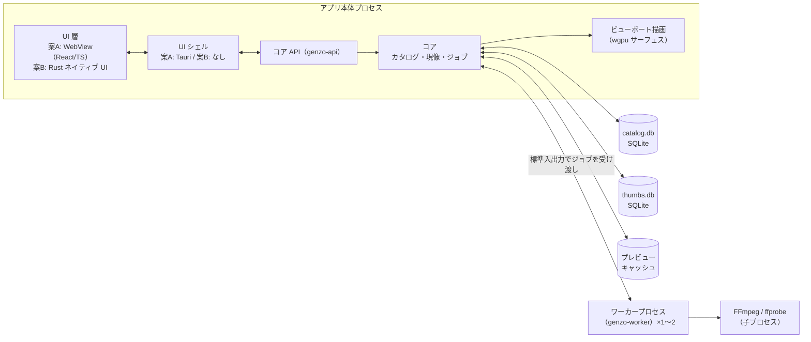
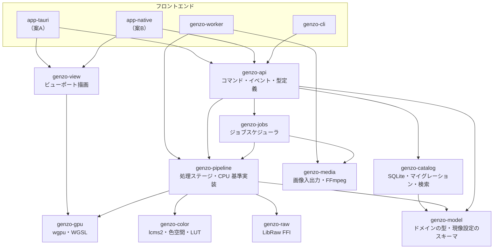
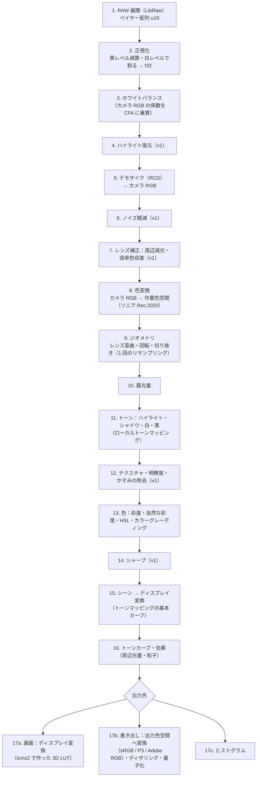
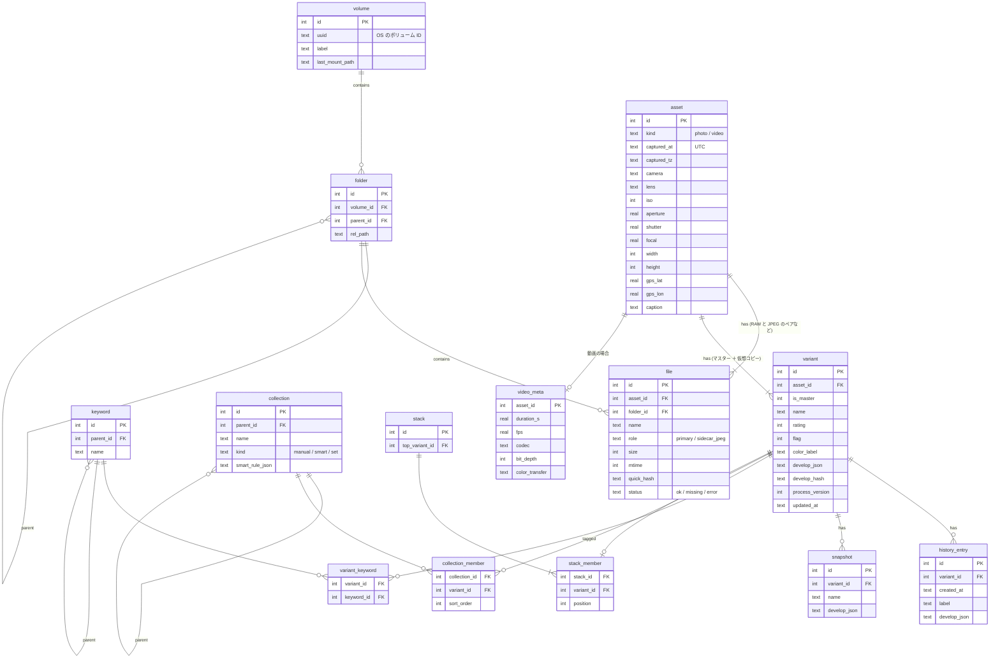
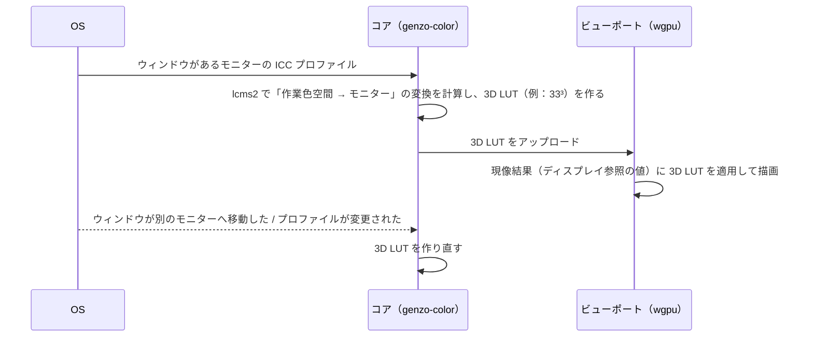
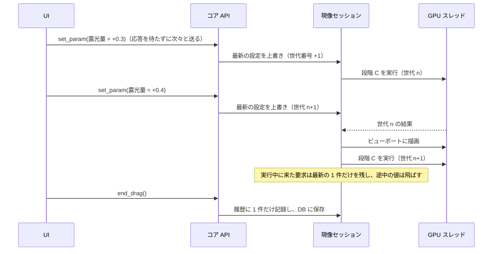

# [4] アーキテクチャ設計

- 入力: `docs/01`〜`docs/03`、`docs/decision_log.md`
- 前提とする技術スタック: **Rust コア ＋ wgpu ＋ SQLite ＋ LibRaw ＋ lcms2 ＋ FFmpeg（子プロセス）**。UI は案 A（Tauri 2 ＋ React / TypeScript）を第 1 候補とし、PoC-1 の結果で案 B（Rust ネイティブ UI）に切り替えられるようにする。
- 位置づけ: たたき台。コード例は設計を説明するためのもので、そのままではコンパイルできない箇所があります。

---

## 1. 全体構成

### 1.1 設計の基本方針

1. **コアは UI を知らない**: 現像エンジン・カタログ・ジョブ管理は、UI から独立した Rust のライブラリ群（crate）として作る。UI は「コア API」（コマンドとイベント）だけを通じてコアを使う。これにより、案 A と案 B を切り替えても、コアはそのまま使える（MAINT-01）。
2. **CPU 版が正、GPU 版は高速化**: すべての現像処理は CPU 版（Rust）を基準実装とし、GPU 版（WGSL）は CPU 版と一致することをテストで保証する（MAINT-02、IQ-07）。
3. **シーンリニアで処理し、最後にディスプレイ向けへ変換する**: 色の処理は、光の量に比例した値（シーンリニア）のまま浮動小数点で行い、トーンマッピングでディスプレイ向けの値に変換する（IQ-01、IQ-02）。
4. **信頼できない入力は隔離する**: 大量のファイルを処理するバッチ作業（取り込み・プレビュー生成）は、別プロセスのワーカーで実行する。壊れたファイルでデコーダが異常終了しても、アプリ本体は落ちない（SEC-05）。
5. **パラメータは解像度に依存させない**: 半径などの空間的なパラメータは「画像サイズに対する割合」で定義する。これにより、縮小プレビューと等倍表示・書き出しで、見た目が一致する。

### 1.2 プロセス構成



| プロセス | 役割 | 理由 |
|---|---|---|
| アプリ本体 | UI、コア API、対話的な現像（ルーペ・現像パネル）、ビューポート描画、カタログへの書き込み | 対話的な処理は応答時間が重要なため、プロセス間通信を挟まない |
| ワーカー（1〜2 個） | 取り込み時のメタデータ読み取り、埋め込みサムネイル抽出、バックグラウンドでのプレビュー生成、一括書き出し | 大量の未知のファイルを扱う処理を隔離する。異常終了したら、そのファイルをエラーとして記録してワーカーを再起動する |
| FFmpeg / ffprobe | 動画のメタデータ取得、サムネイル生成 | 動画デコーダの異常を隔離する。ライセンス上も扱いやすい |

ワーカーはカタログ DB に直接書き込まず、結果を本体に返します。DB に書き込むのは本体だけにして、書き込みの競合を避けます。

### 1.3 スレッド構成（アプリ本体）

| スレッド | 役割 |
|---|---|
| UI スレッド | UI シェルのイベントループ（案 A では Tauri のメインスレッド） |
| コマンド処理（tokio の非同期ランタイム） | UI からのコマンドを受け付け、各サービスに振り分ける |
| GPU スレッド（1 本） | wgpu のデバイスとキューを専有し、現像とビューポート描画のコマンドを順番に実行する |
| DB 書き込みスレッド（1 本） | SQLite への書き込みをすべてここに集める。書き込みはトランザクションでまとめる |
| DB 読み取りプール（数本） | 検索・一覧の読み取り。WAL モードなので、書き込みと並行して読める |
| CPU ワーカープール（rayon） | RAW の展開、CPU 版の現像処理、JPEG のエンコードなど |
| ジョブスケジューラ | 優先度付きのジョブキューを管理する（6 章） |

### 1.4 モジュール（crate）の構成



- 依存の方向は常に上から下です。`genzo-model` は他のどの crate にも依存しません。
- `genzo-gpu` は `genzo-pipeline` が定義する処理ステージの GPU 版です。GPU のない環境（CI）では、`genzo-pipeline` の CPU 版だけで動きます。
- `genzo-cli` は、UI なしで登録・検索・現像・書き出しを行えます。自動テストと、AI による動作確認に使います（ORG-05）。

### 1.5 UI とコアの間のインターフェース

| 種類 | 方向 | 内容 | 案 A での実現方法 | 案 B での実現方法 |
|---|---|---|---|---|
| コマンド | UI → コア | 「フィルターを適用」「レーティングを 3 にする」「露光量を +0.5 にする」など。要求と応答の組 | Tauri のコマンド（JSON） | 関数を直接呼ぶ |
| イベント | コア → UI | 「ジョブの進捗」「カタログが変更された」「プレビューが更新された」 | Tauri のイベント | チャネル |
| サムネイル | コア → UI | グリッドに表示する画像 | カスタム URI スキーム `genzo://thumb/{variant_id}?rev={hash}`（ブラウザのキャッシュが効く） | テクスチャを直接渡す |
| 現像画像 | コア → 画面 | ルーペ・現像のプレビュー | **WebView を通さず、ビューポート（wgpu サーフェス）に直接描画** | 同左 |

- コマンドとイベントの型は Rust 側で定義し、TypeScript の型を自動生成します（ts-rs や specta など）。型の不一致をコンパイル時に検出でき、AI による変更の誤りを防げます。
- 現像のスライダー操作は、コマンドの応答を待たずに次の値を送れるようにします。コア側では、古い要求を捨てて最新の値だけを処理します（7.2 節）。

---

## 2. 現像パイプライン

### 2.1 処理ステージ



| 区間 | ステージ | 色空間 | 数値の範囲 | 精度 |
|---|---|---|---|---|
| センサー | 1〜4 | カメラ RGB（CFA） | 0〜1 を基本とし、WB 後は 1 を超えうる | u16 → f32 |
| シーンリニア（カメラ） | 5〜7 | カメラ RGB | 0〜（上限なし） | f32 |
| シーンリニア（作業） | 8〜14 | リニア Rec.2020 | 0〜（上限なし）。負の値は色域外として保持する | f32 |
| ディスプレイ参照 | 15〜16 | Rec.2020 の色域で、知覚的に均等な符号化（ガンマ約 2.2 相当） | 0〜1 | f32 |
| 出力 | 17 | ディスプレイ / 出力の色空間 | 0〜1 | 画面：16bit 浮動小数点または 10bit ／ 書き出し：8bit・16bit |

**補足**
- **ステージ 3**: ホワイトバランスはデモザイクの前に CFA へ適用します。ユーザーが指定する色温度・色かぶりの値は、カメラ行列を使ってカメラ RGB の係数に変換します。
- **ステージ 9**: レンズの歪曲補正・回転・切り抜きは、座標の変換としてまとめ、リサンプリングを 1 回だけ行います。複数回行うと画質が落ちるためです。この段階より後の処理は、切り抜いた範囲だけを計算します。
- **ステージ 11, 12**: ローカルトーンマッピングとかすみの除去は、画像全体の情報（低周波成分）を使います。そのため、**縮小した画像から「ガイド」（ぼかした輝度など）を先に計算し、タイル処理のときにはそれを拡大して参照** します。これにより、縮小プレビューとフル解像度の結果が一致します。
- **ステージ 13**: 彩度や色相の調整は、リニアな値から知覚的に均等な色空間（OKLab など。どれを使うかは PoC で決定）に変換して行い、リニアに戻します。
- **ステージ 15**: シーンリニアの値（1 を超えうる）を、ディスプレイの表示範囲（0〜1）に滑らかに収める基本カーブです。白飛びを自然に丸めます。HDR 表示（CLR-03）に対応するときは、このステージを差し替えます。
- **ステージ 16**: トーンカーブは、ディスプレイ参照の値に対して適用します。ユーザーが見ている明るさとカーブの横軸が対応するため、操作が直感的になります。色相がずれないよう、輝度に対して適用し、RGB の比率を保ちます（RGB チャンネル別のカーブは例外）。
- **ローカル補正（マスク、v1）**: マスクごとに「露光量 +0.3、彩度 −10」のような調整値の差分を持ちます。ステージ 10〜14 の処理を、マスクの値で重み付けして適用します。Lightroom と同様の考え方です。

### 2.2 プレビューの計算方法と中間キャッシュ

スライダー操作に 33ms 以内で追従する（PERF-01）ため、処理を 3 つの段階に分け、段階の境目で結果をキャッシュします。

| 段階 | 含むステージ | 実行のタイミング | キャッシュ（α7 IV の場合） |
|---|---|---|---|
| **段階 A：センサー処理** | 1〜8 | 写真を開いたとき、または WB・ノイズ軽減・レンズ補正・カメラプロファイルを変更したとき | フル解像度のデモザイク結果は持たず、**プレビュー解像度（長辺 2560px）に縮小した作業色空間の画像** を GPU 上に保持する（約 4.4M 画素 × 16 バイト ≒ 70MB） |
| **段階 B：ガイドの計算** | 11, 12 のガイド | 段階 A の後、またはトーン関連のパラメータを変更したとき | 長辺 512px 程度の低解像度の画像 |
| **段階 C：仕上げ** | 9〜17 | スライダーを操作するたび | なし（毎回計算する） |

- 露光量やトーンカーブのような段階 C のパラメータを変更したときは、**段階 C だけを再計算** します（約 4.4M 画素の処理）。
- WB など段階 A のパラメータを変更したときは段階 A からやり直すため、時間がかかります。ドラッグ中は、さらに縮小した画像（長辺 1280px 程度）で計算して応答性を保ち、指を離したら 2560px で計算し直します。
- **等倍表示・書き出し**: フル解像度を **タイル**（例：1024 × 1024 ＋ 周辺の余白）に分けて段階 A〜C を実行します。段階 B のガイドは、プレビューと同じものを使います。

各段階のキャッシュのキーは「入力ファイルのハッシュ ＋ その段階までのパラメータのハッシュ ＋ 処理バージョン」です。キーが一致すれば再計算を省略します。

### 2.3 CPU 版と GPU 版の一致を保証する方法

- 浮動小数点は 32bit で統一します。GPU でも「高速だが不正確な演算」の最適化は使いません。
- 合計や平均を求める処理（ヒストグラム、ガイドの計算など）は、計算の順序で結果が変わるため、CPU 版と GPU 版で同じ分割と同じ順序で計算します。
- 3D LUT の補間や、テクスチャのサンプリングは、GPU のハードウェア補間に頼らず、自前で補間します（ハードウェア補間は精度が GPU によって異なるため）。
- テスト（MAINT-03）：基準画像のセットで、CPU 版と GPU 版の両方で処理し、差が許容誤差（IQ-07）以内であることを確認します。GPU のない CI では CPU 版の回帰テストだけを行い、GPU 版の比較は開発者の PC（RTX 3080 と M1）で定期的に実行します。

### 2.4 書き出しの経路

- 書き出しは、**GPU 版を既定** とします（PERF-10 の 3 秒以内を満たすため）。GPU が使えない環境やエラーの場合は、CPU 版に切り替えます。
- プレビューと書き出しはどちらも GPU 版で処理するので、両者の一致は構造的に保証されます。CPU 版との一致はテストで保証します。

### 2.5 現像設定のスキーマとバージョン管理

```rust
/// 1 つのバリアント（仮想コピーを含む）の現像設定。
/// カタログには JSON で保存する。
#[derive(Serialize, Deserialize, Clone, PartialEq)]
pub struct DevelopSettings {
    /// スキーマの形（項目の追加・名前の変更）のバージョン。
    pub schema_version: u32,
    /// 処理アルゴリズムのバージョン。値が同じなら、アプリを更新しても結果は変わらない（IQ-08）。
    pub process_version: u32,
    pub white_balance: WhiteBalance,
    pub exposure_ev: f32,             // -5.0 〜 +5.0
    pub tone: ToneParams,             // ハイライト・シャドウ・白・黒（-100 〜 +100）
    pub tone_curve: ToneCurve,
    pub color: ColorParams,           // 彩度・自然な彩度・HSL・カラーグレーディング
    pub geometry: Geometry,           // 切り抜き・回転
    pub lens: LensCorrection,
    pub detail: DetailParams,         // シャープ・ノイズ軽減
    pub masks: Vec<LocalAdjustment>,  // v1
}

pub enum WhiteBalance {
    AsShot,
    Preset(WbPreset),
    Custom { temperature_k: f32, tint: f32 },
}
```

- **schema_version**: 設定の形が変わったときに上げます。古い形式の JSON を読み込んだときは、マイグレーション関数で順番に新しい形式へ変換します。
- **process_version**: アルゴリズムを変更し、同じ設定でも結果が変わる場合に上げます。既存の写真は古い `process_version` のまま、古いアルゴリズムで処理します。新しいアルゴリズムは、ユーザーが明示的に更新した写真にだけ適用します（DATA-09）。
  - そのため、処理ステージのコードは、**処理バージョンごとにアルゴリズムを切り替えられる** ように作ります（ステージの `version` 引数）。古いアルゴリズムのコードは削除せず、回帰テストの対象として残します。

---

## 3. カタログ

### 3.1 ER 図



**設計上の判断**
- **asset（実体）と variant（現像のバリエーション）を分ける**: 1 つの元ファイルから複数の仕上がり（仮想コピー）を作れるようにするためです。グリッドに表示する単位は variant とし、レーティング・フラグ・キーワード・コレクションも variant に付けます（Lightroom の仮想コピーと同じ扱い）。
- **写真と動画を同じ asset テーブルで扱う**: `kind` で区別します。動画に固有の情報は `video_meta` に分けます。これにより、写真と動画を混ぜた一覧・検索（ORG-01）が自然に実現できます。
- **現像設定は JSON で 1 列に保存する**: 項目が多く、バージョンによって変わるためです。検索に使う一部の値（`process_version` など）だけを列として持ちます。
- **撮影日時は UTC と元のタイムゾーンの両方を持つ**: カメラごとの時計のずれやタイムゾーンを補正する機能（LIB-16）のためです。タイムゾーン情報がない動画は、ユーザーが設定した既定のタイムゾーンとみなします。
- **全文検索**: `asset.caption`、ファイル名、キーワード名を対象に FTS5 の仮想テーブルを作ります。

### 3.2 主要なクエリとインデックス

| 用途 | クエリの概要 | インデックス |
|---|---|---|
| グリッドの一覧（撮影日時順） | フィルター条件に合う variant の id を、撮影日時順に **すべて** 取得する | `asset(captured_at)`、`variant(asset_id)` |
| 評価での絞り込み | `rating >= ?` と期間 | `variant(rating)` と `asset(captured_at)`。PoC-6 で実行計画を確認する |
| フォルダの表示 | フォルダ内の variant | `file(folder_id)` |
| キーワードでの検索 | 子のキーワードを含めて検索する（再帰 CTE） | `variant_keyword(keyword_id, variant_id)` |
| テキスト検索 | FTS5 | FTS5 の仮想テーブル |
| カメラ・レンズでの絞り込み | — | `asset(camera)`、`asset(lens)` |

**グリッドの仮想スクロールの方式**: フィルターを適用したとき、条件に合う variant の id を順番どおりに **すべて**（50 万件でも約 4MB）取得して、コアのメモリに保持します。UI は「表示範囲の何番目から何番目」を要求し、コアはその範囲の詳細（評価、ファイル名など）だけを返します。これにより、スクロール位置に関係なく一定の速さで表示できます。

### 3.3 ファイルの移動・リネーム・欠落への対応

- ファイルの場所は「ボリューム ＋ ボリューム内の相対パス」で管理します。ドライブ文字やマウント先が変わっても追跡できます（FILE-03）。
- ファイルの同一性は、**クイックハッシュ**（ファイルサイズ ＋ 先頭と末尾の 64KB のハッシュ）で判定します。全体のハッシュは計算に時間がかかるため、コピー取り込みの検証（IMP-02）でだけ計算します。
- 起動時にすべてのファイルの存在を確認すると時間がかかるため、**表示したときに確認** し、加えてバックグラウンドで少しずつ確認します。見つからないファイルは `status = missing` にし、グリッドに印を付けます。
- 再リンク（FILE-04）では、ユーザーが指定したフォルダからクイックハッシュが一致するファイルを探して結び付け直します。
- アプリ内での移動・リネーム（FILE-02）は、「DB に予定を記録 → ファイルを操作 → DB を確定」の順で行います。途中で失敗した場合は、次回の起動時に予定の記録から状態を復元します（DATA-07）。

### 3.4 データ保全

- SQLite は WAL モード、`synchronous = NORMAL` を基本とします。電源断のときに直前のトランザクションが失われる可能性はありますが、DB は壊れません（DATA-02、DATA-03）。どこまで安全側に寄せるかは PoC-6 の性能と合わせて決めます。
- バックアップは SQLite のオンラインバックアップ API（または `VACUUM INTO`）で、アプリを使いながら一貫性のあるコピーを作ります（DATA-04）。
- スキーマの変更は、番号付きのマイグレーションで行い、適用前に自動でバックアップします（DATA-08）。

---

## 4. プレビュー・サムネイルのキャッシュ

| 階層 | 解像度 | 形式 | 保存場所 | 保持の方針 |
|---|---|---|---|---|
| L0：サムネイル | 長辺 320px | JPEG（品質 80 前後） | `thumbs.db`（SQLite の BLOB） | 全件を保持する（50 万件で 10〜15GB の見込み。SCL-03） |
| L1：標準プレビュー | 長辺 2560px | JPEG（品質 85 前後） | ファイル（`previews/ab/cd/{variant_id}_{hash}.jpg` のように分散） | 上限容量（既定 50GB）の LRU（SCL-04） |
| L2：等倍 | フル解像度 | 保存しない | — | 表示中の写真だけをタイルとしてメモリに保持する |

- **L0 を SQLite に保存する理由**: 50 万個の小さなファイルを作ると、ファイルシステムの操作（作成・削除・ウイルス対策ソフトのスキャン）が遅くなるためです。小さなデータは SQLite に入れた方が速い場合が多いとされています（PoC-6 で確認）。
- **カタログと別の DB にする理由**: サムネイルの DB は消えても作り直せるデータなので、カタログのバックアップに含めないためです。
- **色空間**: キャッシュは **Display P3** で保存し、表示するときにディスプレイ変換（3D LUT）をかけます。モニターを変えてもキャッシュを作り直す必要がありません。
- **無効化**: ファイル名に現像設定のハッシュ（`develop_hash`）を含めます。設定を変えるとハッシュが変わるので、古いキャッシュは使われなくなり、LRU で自然に削除されます。
- **最初の表示**: 取り込み直後は、RAW に埋め込まれた JPEG を L0 / L1 の代わりに使い（PRV-01）、バックグラウンドで現像結果に置き換えます。

---

## 5. ディスプレイの色管理



- アプリが自分で色変換を行うため、**OS による色変換が二重にかからない** ように、サーフェスの設定を確認する必要があります（macOS の CAMetalLayer の色空間設定、Windows のスワップチェーンの色空間）。具体的な設定方法は PoC-1 で確認します。
- グリッドのサムネイル（案 A では WebView 内の画像）は、ICC プロファイル付きの Display P3 の JPEG として配信します。WebView の色管理に任せることになるため、ビューポートほどの正確さは保証しません。

---

## 6. 並行処理とエラー処理

### 6.1 ジョブの優先度

| 優先度 | 例 | 方針 |
|---|---|---|
| P0：対話 | 現像中の写真のプレビュー更新、ルーペに表示中の写真 | 最優先。古い要求は捨てる（最新の 1 件だけを処理する） |
| P1：表示中 | グリッドの表示範囲のサムネイル | スクロールで表示範囲から外れたら取り消す |
| P2：先読み | ルーペで前後の写真、グリッドの少し先 | P0、P1 がないときに実行する |
| P3：バックグラウンド | プレビューの一括生成、書き出し、整合性チェック | 空いているときに実行する。進捗を表示し、キャンセルできる |

- すべてのジョブに **取り消しトークン** を持たせます。処理の区切り（タイルごと、ステージごと）で確認し、取り消されたら途中でやめます。
- GPU を使うジョブは、GPU スレッドのキューに優先度順に積みます。P3 の書き出しは小さなタイルに分けて実行し、P0 の要求が来たらタイルの合間に割り込めるようにします（PERF-13）。

### 6.2 スライダー操作の流れ



- スライダーをドラッグしている間の値の変化は、**ドラッグの終了時に履歴へ 1 件だけ記録** します（DEV-27）。
- DB への保存は、ドラッグの終了時、または最後の操作から 1 秒後に行います（DATA-03）。

### 6.3 エラー処理

| 状況 | 対応 |
|---|---|
| 壊れたファイル・対応していない形式 | そのファイルを `status = error` にし、理由を記録する。一覧にはエラーの印を表示する。他のファイルの処理は続ける |
| ワーカーの異常終了 | 処理中だったファイルをエラーとして記録し、ワーカーを再起動する。同じファイルで 2 回続けて異常終了した場合は、そのファイルを以後スキップする |
| GPU のエラー（デバイスの消失など） | GPU を初期化し直す。失敗が続く場合は CPU 版に切り替え、その旨を表示する |
| ディスクの空き容量の不足 | プレビューキャッシュを LRU で減らす。カタログへの書き込みに失敗した場合は、操作を取り消してユーザーに知らせる |
| カタログの整合性エラー | 起動時のチェックで検出した場合、バックアップからの復元を案内する（DATA-05） |

---

## 7. 拡張性

### 7.1 処理ステージのインターフェース

新しい補正処理は、次のトレイトを実装して登録します（MAINT-08）。動的に読み込むプラグインではなく、コンパイル時に組み込みます。

```rust
/// 現像パイプラインの 1 ステージ。
pub trait Stage: Send + Sync {
    /// 一意な ID（例: "exposure"）。
    fn id(&self) -> &'static str;

    /// 段階 A / B / C のどこに属するか（2.2 節）。
    fn phase(&self) -> Phase;

    /// 現像設定からこのステージのパラメータを取り出す。
    /// 何もしない設定（露光量 0 など）なら None を返し、ステージを飛ばす。
    fn params(&self, settings: &DevelopSettings) -> Option<StageParams>;

    /// 出力の範囲を計算するのに必要な入力の範囲（周辺の画素を使う処理や、ジオメトリの変換のため）。
    fn input_roi(&self, output_roi: Roi, params: &StageParams) -> Roi;

    /// CPU 版の基準実装。process_version によってアルゴリズムを切り替える。
    fn run_cpu(&self, ctx: &StageContext, input: &ImageTile, output: &mut ImageTile, params: &StageParams);

    /// GPU 版の実装（WGSL）。未実装なら None を返し、CPU 版で処理する。
    fn gpu(&self) -> Option<&dyn GpuStage>;
}
```

- GPU 版が未実装のステージがあっても動きます（その部分だけ CPU で処理する）。新しい処理は CPU 版から作り、テストで正しさを確認してから GPU 版を追加する進め方ができます。
- ステージの CPU 版と GPU 版の一致テストは、ステージを登録すると自動で対象になるようにします。

### 7.2 AI 機能を差し込む位置

| 機能 | 差し込む位置 | インターフェース |
|---|---|---|
| AI ノイズ除去（DEV-22） | ステージ 5〜6（デモザイク後のカメラ RGB）。デモザイクとノイズ除去を同時に行うモデルの場合は、ステージ 5 を置き換える | `Stage` として実装する。推論は `MlBackend` トレイト経由で行う |
| AI マスク（DEV-20） | マスクの生成元として追加する。生成したマスクは画像として保存し、現像のたびに推論し直さない | `MaskSource` トレイト（ブラシ・グラデーション・範囲マスクと同じ扱い） |
| 顔認識・自然言語検索（LIB-19、LIB-20） | バックグラウンドのジョブ（P3）で推論し、結果をカタログの別テーブルに保存する | ジョブとして実装する |

`MlBackend` は ONNX Runtime を包む抽象で、Windows では CUDA または DirectML、macOS では Core ML を選べるようにします。

```rust
pub trait MlBackend: Send + Sync {
    fn load(&self, model: &ModelSpec) -> Result<Box<dyn MlSession>>;
}
pub trait MlSession: Send {
    fn run(&mut self, inputs: &[Tensor]) -> Result<Vec<Tensor>>;
}
```

---

## 8. 設計上のトレードオフと、採用しなかった案

| 論点 | 採用した案 | 採用しなかった案 | 理由 |
|---|---|---|---|
| バッチ処理の実行場所 | 別プロセスのワーカー | すべて本体プロセスで実行 | デコーダの異常でアプリ全体が落ちるのを防ぐ（SEC-05）。プロセス間通信のコストは、バッチ処理なら許容できる |
| 対話的な現像の実行場所 | 本体プロセス | ワーカー | 応答時間（PERF-01）を優先する。現像中の写真はすでに一度開けたファイルなので、リスクは小さい |
| レーティングなどを付ける単位 | variant | asset | 仮想コピーごとに異なる評価を付けられるようにする |
| 現像設定の保存形式 | JSON で 1 列 | 項目ごとに列を分ける | 項目が多く、バージョンで変化する。設定値で検索する用途はほとんどない |
| サムネイルの保存 | SQLite の BLOB | 1 件 1 ファイル | 50 万個の小さなファイルを避ける |
| 色の処理方式 | シーンリニア ＋ 最後にトーンマッピング | ディスプレイ参照で処理（従来型） | 露光量の変更やハイライトの扱いが物理的に自然で、画質の制御がしやすい（重視点 1） |
| トーンカーブの位置 | ディスプレイ参照の段階（16） | シーンリニアの段階 | ユーザーが見ている明るさとカーブが対応し、直感的に操作できる |
| 書き出しの処理系 | GPU 版を既定とし、CPU 版は予備 | CPU 版を既定 | 書き出しの速度（PERF-10）と、プレビューとの一致を両立する |
| グリッドの一覧取得 | 条件に合う id をすべて取得し、詳細は範囲ごとに取得 | ページごとに取得（LIMIT と OFFSET） | OFFSET は後ろのページほど遅くなる。任意の位置へのスクロールに対応しやすい |

---

## 9. 未決事項・リスク

| No | 内容 | 影響 | 対応 |
|---|---|---|---|
| R-1 | ビューポート（wgpu）と WebView の合成が、両 OS で安定して動くか | UI の構成（案 A か B か） | PoC-1 |
| R-2 | OS による色変換が二重にかからないようにする、サーフェスの色空間の設定方法 | 表示の色の正確さ（IQ-05） | PoC-1 |
| R-3 | 段階 A をプレビュー解像度で保持する方式で、WB の変更時の応答性が足りるか | PERF-01 | PoC-3 |
| R-4 | ガイドを使ったローカルトーンマッピングで、プレビューと等倍表示の見た目が一致するか | IQ-07 | PoC-5 |
| R-5 | 32bit 浮動小数点のテクスチャの扱い（GPU による補間の可否、メモリ量）。M1 の統合メモリで足りるか | SCL-05、SCL-06 | PoC-3。M1 Mac のメモリ容量の確認 |
| R-6 | 彩度・色相の調整に使う知覚的な色空間（OKLab など）と、シーン → ディスプレイ変換のカーブの選定 | 画質（重視点 1） | PoC-4 と並行して比較する |
| R-7 | LibRaw をマルチスレッドで使うときの制約（インスタンスをスレッドごとに分ければ並行して使えるか） | 取り込み・プレビュー生成の速度 | 公式ドキュメントで確認する |
| R-8 | デモザイク（RCD）の移植元のライセンス | アプリのライセンス（GPL-3.0） | 移植前に確認する |
| R-9 | サムネイルを SQLite に保存する方式の性能（50 万件、10〜15GB） | PERF-06 | PoC-6 |
