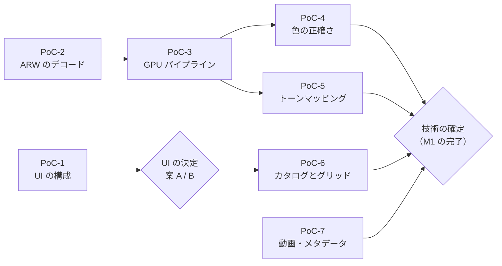
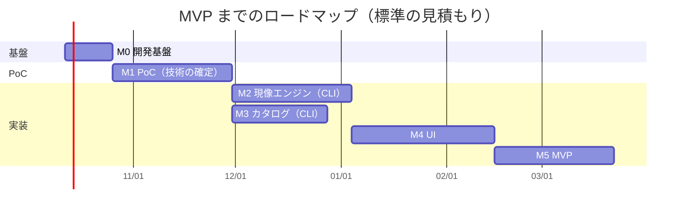

# [5] PoC 計画とロードマップ

- 入力: `docs/01`〜`docs/04`、`docs/decision_log.md`
- 位置づけ: たたき台。**期間の見積もりは不確実性が大きい** ため、M1（PoC）が終わった時点で見直す前提です。

## 0. 見積もりの前提

| 項目 | 前提 |
|---|---|
| 開発の進め方 | AI（コーディングエージェント）が実装し、人がレビュー・方針決定・実機での確認・サンプル撮影を行う |
| 人の関与 | **週 10 時間程度** と仮定する（前提条件シートでは期限・時間とも未定のため、仮置き） |
| 期間の単位 | 週。人のレビュー待ちと、実機（Windows / M1 Mac）での確認にかかる時間を含む |
| ボトルネック | AI の実装速度よりも、**人によるレビュー・実機での確認・画質の目視評価** が律速になると想定する |
| 開始日 | 2026-10-12（月）と仮定する |

---

## 1. PoC 計画

リスクの高い順（失敗したら技術選定や設計を見直す必要が大きい順）に並べています。

### PoC-1：UI の構成（ビューポートの合成と色管理された表示）

| 項目 | 内容 |
|---|---|
| 目的 | 案 A（Tauri 2）と案 B（Rust ネイティブ UI）のどちらにするかを決める（R-1, R-2） |
| 検証内容 | (1) Tauri 2 のウィンドウで、wgpu で描画した画像の上に透明な WebView を重ね、スライダーなどの UI を表示する ／ (2) モニターの ICC プロファイルを取得し、lcms2 で作った 3D LUT を適用して描画する ／ (3) OS による色変換が二重にかからないサーフェスの設定 |
| サンプルデータ | 色の基準になる画像（sRGB と Display P3 のテスト画像）、PoC-2 で展開した ARW |
| 測定方法 | Windows と M1 Mac の両方で、リサイズ・モニター間の移動・スライダー操作を行う。フレーム時間を計測し、色を OS 標準のビューアと見比べる |
| 合格基準 | 両 OS でちらつき・ずれ・描画の遅れがない。スライダー操作中に 30fps 以上。色が OS 標準のビューアと目視で一致する |
| 想定工数 | 2〜3 週 |
| 不合格の場合 | (a) ビューポートを別のネイティブ子ウィンドウにする方式を試す ／ (b) 案 B（Slint などの Rust ネイティブ UI）に切り替え、同じ検証を行う（＋2〜3 週） |

### PoC-3：最小の GPU パイプライン

| 項目 | 内容 |
|---|---|
| 目的 | 性能の根幹（PERF-01, PERF-10）と、CPU 版と GPU 版の一致（IQ-07）を確認する（R-3, R-5） |
| 検証内容 | 黒レベル補正 → WB → デモザイク（RCD）→ カメラ行列 → 露光量 → 簡易トーンカーブ → ディスプレイ変換を、CPU 版（Rust）と GPU 版（WGSL）の両方で実装する。2.2 節の 3 段階のキャッシュも実装する |
| サンプルデータ | α7 IV の ARW（ISO 100 の風景、細かい模様のある被写体）、α7C の ARW |
| 測定方法 | 長辺 2560px のプレビューで段階 C だけを再計算したときの時間と、段階 A からやり直したときの時間を計測する。フル解像度の処理時間とメモリ使用量を計測する。CPU 版と GPU 版の出力の差を計算する |
| 合格基準 | M1 Mac で、段階 C の再計算が 33ms 以内。フル解像度の処理（書き出し相当）が 3 秒以内。CPU 版と GPU 版の差が 8bit 換算で ±1 以内。メモリ使用量が 4GB 以下 |
| 想定工数 | 3〜4 週 |
| 不合格の場合 | プレビューの解像度を下げる、段階の分け方を見直す。一致しない場合は、原因の演算を特定し、自前の実装に置き換える |

### PoC-4：色の正確さ

| 項目 | 内容 |
|---|---|
| 目的 | 重視点 1（色の正確さ）を満たせるかを確認する（R-6） |
| 検証内容 | LibRaw のカメラ行列で色変換し、カラーチャートの各色パッチの色差を計算する。彩度などの調整に使う知覚的な色空間（OKLab など）と、シーン → ディスプレイ変換のカーブの候補を比較する |
| サンプルデータ | **カラーチャート（ColorChecker Classic など）を、晴天の屋外で適正露出で撮影した ARW**（α7 IV と α7C の両方） |
| 測定方法 | 各色パッチの平均値を取り、チャートの基準値との ΔE2000 を計算する |
| 合格基準 | 平均 ΔE2000 が 3 以下（IQ-04） |
| 想定工数 | 1〜2 週（PoC-3 の成果を使う） |
| 不合格の場合 | カラーチャートから独自のカメラプロファイルを作成する（作成ツールの選定とライセンスの確認が必要） |

### PoC-2：ARW のデコード

| 項目 | 内容 |
|---|---|
| 目的 | LibRaw で手持ちの ARW をすべて正しく展開できるかを確認する |
| 検証内容 | Rust から LibRaw を FFI で呼び出し、Windows と macOS でビルドする。RAW データ・黒レベル・白レベル・カメラ行列・撮影時の WB・埋め込み JPEG・撮影情報を取得する |
| サンプルデータ | α7 IV と α7C で、**カメラで選べる記録方式（非圧縮・圧縮・ロスレス圧縮など）すべて** で撮影した ARW |
| 測定方法 | 展開の成否と、1 枚あたりの展開時間を計測する。複数スレッドで並行して展開できるかを確認する（R-7） |
| 合格基準 | すべての記録方式で正しく展開できる。両 OS でビルドできる |
| 想定工数 | 1 週（PoC-1 と並行して進める） |
| 不合格の場合 | LibRaw のバージョンを上げる。RawSpeed または rawler を試す |

### PoC-5：ローカルトーンマッピング

| 項目 | 内容 |
|---|---|
| 目的 | ハイライト・シャドウの調整の画質と速度、プレビューと等倍表示の一致を確認する（R-4） |
| 検証内容 | 縮小画像からガイドを計算し、タイル処理で参照する方式（04 の 2.2 節）で、ハイライト・シャドウを実装する。手法の候補（ガイデッドフィルタ、ラプラシアンピラミッドなど）を比較する |
| サンプルデータ | 逆光の人物・空と建物など、明暗差の大きい写真 |
| 測定方法 | ハロー（明暗の境目のにじみ）を目視で評価する。処理時間を計測する。縮小プレビューとフル解像度を同じサイズに縮小して差を計算する |
| 合格基準 | ハローが目立たない。PoC-3 のパイプラインに追加しても 33ms 以内。プレビューとフル解像度の差が IQ-07 の範囲内 |
| 想定工数 | 2 週 |
| 不合格の場合 | 手法を変える。ガイドの解像度を上げる |

### PoC-6：大規模カタログとグリッド表示

| 項目 | 内容 |
|---|---|
| 目的 | 50 万件での閲覧・検索性能を確認する（R-9） |
| 検証内容 | 04 の 3 章のスキーマで、ダミーの 50 万件を作る。フィルター・並べ替え・キーワード検索・全文検索を実行する。サムネイル DB（SQLite の BLOB）から、案 A ならカスタム URI スキームで配信し、React の仮想スクロールで表示する |
| サンプルデータ | ダミーデータ（自動生成）。サムネイルは、実際の写真から作ったものを繰り返し使う |
| 測定方法 | クエリの実行時間、スクロール中のフレームレート、DB のサイズを計測する |
| 合格基準 | フィルターが 0.2 秒以内（PERF-07）。スクロールが 60fps（PERF-06）。カタログ DB が 5GB 以下（SCL-02） |
| 想定工数 | 1〜2 週 |
| 不合格の場合 | インデックスを見直す。サムネイルの保存方式（ファイルにする）や配信方式を変える |

### PoC-7：動画とメタデータ

| 項目 | 内容 |
|---|---|
| 目的 | 動画のカタログ管理と、メタデータの取得手段を確認する |
| 検証内容 | ffprobe でメタデータ（撮影日時・長さ・コーデック・ビット深度・色の情報）を、ffmpeg でサムネイルを取得する。LibRaw で、レンズ名など必要なメタデータが取れるかを確認する |
| サンプルデータ | DJI Osmo Pocket で、**実際に使う記録設定すべて**（解像度・フレームレート・コーデック・10bit や Log の有無）で撮影した短い動画 |
| 測定方法 | 1 本あたりの処理時間を計測し、取得できた項目を確認する |
| 合格基準 | 両 OS で 1 本あたり 2 秒以内（PERF-11）。必要なメタデータがそろう |
| 想定工数 | 1 週 |
| 不合格の場合 | ハードウェアデコードを使う。メタデータが足りない場合は Exiv2 を追加する |

### PoC の進め方

- PoC-1 と PoC-2 は独立しているので、最初に並行して始めます。
- PoC-7 は他に依存しないので、空いた時間に進めます。
- すべての PoC が終わった時点で「技術の確定」を行い、決定事項ログに記録します。

---

## 2. ロードマップ

### 2.1 マイルストーン

| マイルストーン | 完了したときにできること | 主なタスク | 楽観 | 標準 | 悲観 |
|---|---|---|---:|---:|---:|
| **M0：開発基盤** | CI が Windows と macOS で動き、テストと回帰テストの仕組みがある | リポジトリ構成（Rust の workspace）、CI、ライセンスの決定、回帰テストの基盤、サンプルデータの準備 | 1 週 | 2 週 | 3 週 |
| **M1：PoC** | 技術スタックが確定している | PoC-1〜7 | 3 週 | 5 週 | 8 週 |
| **M2：現像エンジン（CLI）** | コマンドで ARW を JPEG に現像できる。基本補正（WB・露光量・トーン・トーンカーブ・彩度・切り抜き）を CPU 版と GPU 版の両方で処理でき、回帰テストがある | `genzo-pipeline`、`genzo-gpu`、`genzo-color`、`genzo-raw`、`genzo-cli` | 3 週 | 5 週 | 8 週 |
| **M3：カタログ（CLI）** | コマンドでフォルダを登録・検索でき、サムネイルが生成される。動画も登録できる | `genzo-catalog`、`genzo-jobs`、`genzo-worker`、`genzo-media` | 2 週 | 4 週 | 6 週 |
| **M4：UI** | グリッド・ルーペ・選別・フィルター・現像パネルを画面で操作できる | UI の実装、コア API、ビューポート、色管理された表示 | 4 週 | 6 週 | 10 週 |
| **M5：MVP** | MVP のユーザーストーリー（01 の 5 章）をすべて満たし、社内のメンバーに配布して日常的に使い始められる | 書き出し、履歴・Undo、一括適用、バックアップ、削除、インストーラー、性能の調整、不具合の修正 | 3 週 | 5 週 | 8 週 |

**MVP までの期間**

| | 楽観 | 標準 | 悲観 |
|---|---:|---:|---:|
| すべてを順番に進めた場合の合計 | 16 週 | 27 週 | 43 週 |
| M2 と M3 を並行して進めた場合 | **14 週** | **23 週** | **37 週** |
| 完了の目安（2026-10-12 開始、並行した場合） | 2027-01-18 頃 | **2027-03-22 頃** | 2027-06-28 頃 |

- M2 と M3 は、どちらも M1 の後に始められ、互いに依存しないので並行できます。並行した場合の期間は、長い方（M2）で決まります。
- 悲観の見積もりは、PoC-1 で案 B への切り替えが必要になった場合や、画質の作り込みに想定以上の時間がかかった場合を想定しています。

### 2.2 ガントチャート（標準の見積もり、M2 と M3 を並行）

### 2.3 MVP の後（v1）の進め方

v1 の機能（01 の機能一覧で「v1」としたもの、44 件）は、日常的に使ってみて不便を感じた順に取り組むのが効率的です。現時点での推奨の順番は次のとおりです。

1. **レンズ補正**（DEV-14）: 補正を前提にしたレンズでは、ないと画質に影響するため
2. **キーワード・コレクション・スマートコレクション**（LIB-09〜11）: 写真が増えると整理に必要になるため
3. **撮影日時の一括修正・写真と動画の統合タイムライン**（LIB-16, ORG-01）: Sony と DJI を混ぜて使う前提のため
4. **マスク・範囲マスク**（DEV-18, 19）
5. **HSL・カラーグレーディング・明瞭度など**（DEV-09〜11）
6. **ノイズ軽減・シャープ**（DEV-12, 13）
7. **ファイル管理**（FILE-02〜04）と、動画の再生（VID-04）

---

## 3. 最初の 2 週間でやること（M0）

### 1 週目

| No | タスク | 担当 | 完了の条件 |
|---|---|---|---|
| 1 | **アプリのライセンスを決める**（GPL-3.0-or-later を推奨。03 の 2.3 節） | 人 | 決定事項ログに記録する |
| 2 | **サンプルデータの撮影**（下表） | 人 | 撮影した一覧ができている |
| 3 | **サンプルデータの置き場所を決める**（後述の注意を参照） | 人 | 置き場所と、アクセスする方法が決まっている |
| 4 | Rust の workspace と crate の雛形を作る（04 の 1.4 節の構成） | AI | `cargo build` が通る |
| 5 | CI を作る（GitHub Actions、Windows と macOS の Apple Silicon）。フォーマット・リンター（警告をエラーとして扱う）・テストを実行する | AI | 両 OS で CI が成功する |
| 6 | 依存ライブラリのライセンスと脆弱性の確認を CI に入れる（cargo-deny など） | AI | CI で実行される |
| 7 | PoC-2 を始める：LibRaw を Rust から呼び出すラッパーを作り、両 OS でビルドする | AI | サンプルの ARW から撮影情報を表示できる |

### 2 週目

| No | タスク | 担当 | 完了の条件 |
|---|---|---|---|
| 8 | PoC-2 を終える：全記録方式の ARW を展開し、時間を計測する | AI ＋ 人（結果の確認） | 結果を文書にまとめる |
| 9 | PoC-1 を始める：Tauri 2 で、wgpu の描画の上に透明な WebView を重ねる最小のアプリを作る | AI | 両 OS で起動し、画像とスライダーが表示される |
| 10 | 両 OS で、モニターの ICC プロファイルを取得する処理を作る | AI | 取得したプロファイルの名前を表示できる |
| 11 | 回帰テストの基盤を作る：2 枚の画像の差（最大差、ΔE2000）を計算し、基準画像と比べるテストの仕組み | AI | サンプル画像でテストが動く |
| 12 | ベンチマークの基盤を作る（処理時間を記録し、前回と比べられる） | AI | CI またはローカルで実行できる |
| 13 | 2 週間の結果をレビューし、決定事項ログと見積もりを更新する | 人 | ログが更新されている |

### サンプルデータの撮影リスト

| No | 機材 | 内容 | 使う PoC |
|---|---|---|---|
| 1 | α7 IV | カメラで選べる RAW の記録方式すべてで、同じ被写体を撮影する | PoC-2 |
| 2 | α7C | 同上 | PoC-2 |
| 3 | α7 IV・α7C | カラーチャートを晴天の屋外で、適正露出で撮影する（カラーチャートを持っていない場合は入手が必要） | PoC-4 |
| 4 | α7 IV | 細かい模様（布、建物の外壁、遠くの木の葉など）。ISO 100 | PoC-3 |
| 5 | α7 IV | 明暗差の大きい場面（逆光、窓のある室内、夕景） | PoC-5 |
| 6 | α7 IV | 高感度（ISO 3200〜12800 程度）の写真 | v1 のノイズ軽減の準備 |
| 7 | DJI Osmo Pocket | 実際に使う記録設定ごとに 10 秒程度の動画 | PoC-7 |

### 注意：サンプルデータの扱い

- このリポジトリは **OSS として公開する予定** です。人物が写った写真や、自宅の位置がわかる GPS 情報を含む写真を、リポジトリに入れないでください。
- RAW ファイルは 1 枚あたり数十 MB あるため、Git のリポジトリには入れず、**公開されない別の保存場所**（個人のクラウドストレージなど）に置くことを推奨します。どこに置くかと、誰がアクセスできるかは、利用者の範囲を確認したうえで決めてください。
- 回帰テストの基準画像を公開リポジトリに含める場合は、人物や個人情報を含まない被写体（カラーチャート、風景、テスト用の被写体）だけを使い、GPS 情報を削除してください。

---

## 4. リスクと、見積もりを見直すタイミング

| タイミング | 見直す内容 |
|---|---|
| M0 の完了時（2 週間後） | 人の関与の時間（週 10 時間の仮定）が実態に合っているか |
| PoC-1 の完了時 | 案 A / B の決定。案 B に切り替える場合は、M4 の見積もりを見直す |
| M1 の完了時 | M2〜M5 の見積もり全体。PoC で判明した課題を反映する |
| M4 の途中 | MVP の範囲（37 件）を減らす必要があるか |
