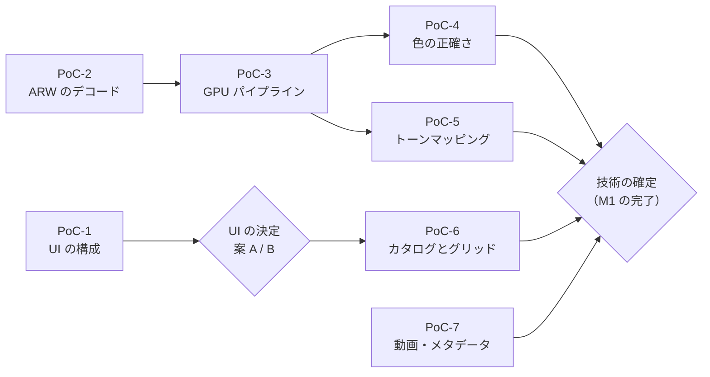
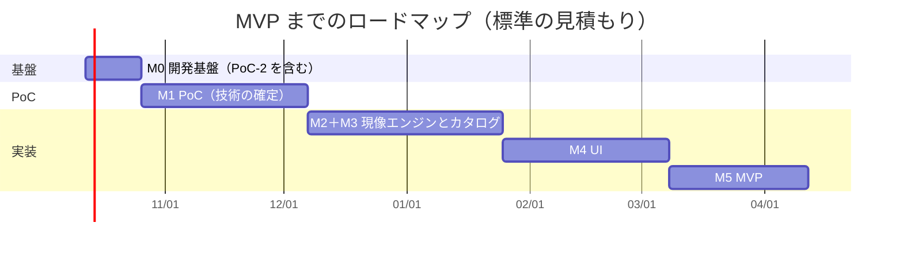

# [5] PoC 計画とロードマップ

- 入力: `docs/01`〜`docs/04`、`docs/decision_log.md`
- 位置づけ: たたき台。**期間の見積もりは不確実性が大きい** ため、M1（PoC）が終わった時点で見直す前提です。
- 設計レビュー（`06_design_review.md`）の指摘を反映済みです。各指摘への対応は `07_review_response.md` にまとめています。

## 0. 見積もりの前提

| 項目 | 前提 |
|---|---|
| 開発の進め方 | AI（コーディングエージェント）が実装し、人がレビュー・方針決定・実機での確認・サンプル撮影を行う |
| 人の関与 | **週 10 時間程度** と仮定する（前提条件シートでは期限・時間とも未定のため、仮置き） |
| 期間の単位 | 週。人のレビュー待ちと、実機（Windows / M1 Mac）での確認にかかる時間を含む |
| ボトルネック | AI の実装速度よりも、**人によるレビュー・実機での確認・画質の目視評価** が律速になると想定する |
| 開始日 | 2026-10-12（月）と仮定する |

---

## 1. PoC 計画

リスクの高い順（失敗したら技術選定や設計を見直す必要が大きい順）に並べています。

### PoC-1：UI の構成（ビューポートの合成と色管理された表示）

| 項目 | 内容 |
|---|---|
| 目的 | 案 A（Tauri 2）と案 B（Rust ネイティブ UI）のどちらにするかを決める（AR-1, AR-2） |
| 検証内容 | (1) Tauri 2 のウィンドウで、wgpu で描画した画像の上に透明な WebView を重ね、スライダーなどの UI を表示する ／ (2) モニターの ICC プロファイルを取得し、lcms2 で作った 3D LUT を適用して描画する ／ (3) OS による色変換が二重にかからないサーフェスの設定 |
| サンプルデータ | 色の基準になる画像（sRGB と Display P3 のテスト画像）、PoC-2 で展開した ARW |
| 測定方法 | Windows と M1 Mac の両方で、下のチェック表のシナリオを実行し、結果と再現手順を記録する。フレーム時間は入力イベントから画面への表示までで測る（1.8 節）。色は、3D LUT の出力と lcms2 による直接の変換結果を数値で比べ、そのうえで OS 標準のビューアと目視で比べる |
| チェック表（レビュー R-17） | ① 表示倍率 100% / 150% / 200%（Windows）と Retina（Mac） ② 表示倍率の異なるモニター間の移動 ③ ビューポート上でのズーム・パン・切り抜き枠のドラッグ（WebView を重ねた状態でマウス操作が正しく届くか、画像の座標が正しいか） ④ キーボードのフォーカスとショートカット ⑤ ビューポートの上に重ねた入力欄での日本語 IME ⑥ メニュー・ダイアログ ⑦ 最小化と復帰 ⑧ GPU の再初期化（デバイスの消失）からの復帰 ⑨ Windows で HDR が有効なモニターでの SDR 表示 ⑩ グリッドのサムネイル（WebView）とビューポートの色の差 |
| 合格基準 | チェック表のすべての項目が両 OS で問題ない。スライダー操作中の入力から表示までの時間が 95 パーセンタイルで 33ms 以内。3D LUT と lcms2 の直接変換の差が ΔE2000 で最大 1 以下（仮置き）。色が OS 標準のビューアと目視で一致する。グリッドとビューポートの色の差の許容条件を決めて記録する。※画像が表示できたことや fps が高いことだけで UI を決定しない |
| 想定工数 | 2〜3 週 |
| 不合格の場合 | (a) ビューポートを別のネイティブ子ウィンドウにする方式を試す ／ (b) 案 B（Slint などの Rust ネイティブ UI）に切り替え、**同じチェック表** で検証する（＋2〜3 週） |

### PoC-3：最小の GPU パイプライン

| 項目 | 内容 |
|---|---|
| 目的 | 性能の根幹（PERF-01, PERF-10）と、CPU 版と GPU 版の一致（IQ-07a）を確認する（AR-3, AR-5） |
| 検証内容 | 黒レベル補正 → WB → デモザイク（RCD）→ カメラ行列 → 露光量 → 簡易トーンカーブ → ディスプレイ変換を、CPU 版（Rust）と GPU 版（WGSL）の両方で実装する（処理順序と色の定義は 04 の 2.1 節・2.6 節を正とする）。04 の 2.2 節の段階分けとキャッシュ、WB 変更時の 2 × 2 の簡易処理も実装する |
| サンプルデータ | α7 IV の ARW（ISO 100 の風景、細かい模様のある被写体）、α7C の ARW |
| 測定方法 | 1.8 節のルールで計測する。(1) 露光量のドラッグ（段階 C）と WB のドラッグ（段階 A1、簡易処理）の、入力から表示までの時間 ／ (2) WB を離した後の最終品質の描画時間（コールドとウォーム） ／ (3) フル解像度の処理を、計算・RAW の展開・転送・JPEG のエンコード・ファイルの書き込みに分けた時間 ／ (4) 本体とワーカーを合わせたメモリ使用量 ／ (5) CPU 版と GPU 版の差（ステージごとと最終出力。IQ-07a） ／ (6) フル解像度を縮小した結果とプレビューの差（IQ-07b） |
| 合格基準 | M1 Mac で：露光量のドラッグが 95 パーセンタイルで 33ms 以内（PERF-01）。WB のドラッグが 15fps 以上、離してから 0.5 秒以内（PERF-01b）。JPEG の書き出しまで含めて 3 秒以内（PERF-10）。IQ-07a と IQ-07b を満たす。メモリ使用量が 4GB 以下（SCL-05）。RTX 3080 でも同じ項目を計測し、GPU 間の差を記録する |
| 想定工数 | 3〜4 週 |
| 不合格の場合 | プレビューの解像度を下げる、段階の分け方を見直す。一致しない場合は、原因の演算を特定し、自前の実装に置き換える。それでも満たせない場合は、目標値を見直して決定事項ログに記録する（「全件合格」と扱わない） |

### PoC-4：色の正確さ

| 項目 | 内容 |
|---|---|
| 目的 | 重視点 1（色の正確さ）を満たせるかを確認する（AR-6） |
| 検証内容 | (1) **カメラの色変換の評価**: 04 の 2.6 節の方法で色変換し、カラーチャートの各色パッチの色差を計算する。トーンカーブやステージ 15 などの見た目のための処理は含めない ／ (2) 彩度などの調整に使う知覚的な色空間（OKLab など）、シーン → ディスプレイ変換のカーブ、色域圧縮の方式の候補を比較する（こちらは画質の評価で、(1) とは分けて扱う） |
| サンプルデータ | **カラーチャート（ColorChecker Classic など）を、晴天の屋外で適正露出で撮影した ARW**（α7 IV と α7C の両方） |
| 測定方法（レビュー R-13） | ① 基準値: 使うチャートの製造時期に対応した、メーカー公表の Lab 値（D50）を使い、Bradford 法で D65 に色順応させる ／ ② 照明: 晴天の直射日光の下で、チャートに影や映り込みがない状態 ／ ③ WB: チャートの中間のグレーのパッチで合わせる ／ ④ 露出: 指定したグレーのパッチの L* が基準値と一致するように、露光量だけで合わせる ／ ⑤ 評価: ステージ 8 の出力（B2）を XYZ → Lab に変換し、各パッチの中央部分の平均で ΔE2000 を計算する ／ ⑥ 報告: 平均・最大と、グレーのパッチの a*・b* の偏り。撮影データの ID とハッシュ、設定を記録する |
| 合格基準 | 平均 ΔE2000 が 3 以下（IQ-04）。最大値とグレーの偏りも記録し、目立つ外れ値がないかを確認する。独自プロファイルを作った場合は、作成に使っていない別の撮影（別の日時）で評価する |
| 想定工数 | 1〜2 週（PoC-3 の成果を使う） |
| 不合格の場合 | カラーチャートから独自のカメラプロファイルを作成する（作成ツールの選定とライセンスの確認が必要） |

### PoC-2：ARW のデコード

| 項目 | 内容 |
|---|---|
| 目的 | LibRaw で手持ちの ARW をすべて正しく展開できるかと、ワーカープロセスでの隔離の方式を確認する（AR-7, AR-10） |
| 検証内容 | Rust から LibRaw を FFI で呼び出し、Windows と macOS でビルドする。RAW データ・黒レベル・白レベル・カメラ行列・撮影時の WB・埋め込み JPEG・撮影情報を取得する。**LibRaw の各行列（`cam_xyz`、`rgb_cam` など）の意味と基準の光源を、実際の API とデータで確認する**（04 の 2.6 節）。展開を **ワーカープロセス** で行い、共有メモリで本体に渡す最小の仕組みを作る（04 の 1.2 節） |
| サンプルデータ | α7 IV と α7C で、**カメラで選べる記録方式（非圧縮・圧縮・ロスレス圧縮など）すべて** で撮影した ARW |
| 測定方法 | 展開の成否と、1 枚あたりの展開時間を計測する。CFA の実際のバッファのサイズ（余白を含む）を記録する。複数スレッドで並行して展開できるかを確認する。**壊れたファイル**（途中で切れたもの、メタデータは読めるが画像データが壊れたもの、寸法が異常なもの、処理が終わらないもの）を入力して、ワーカーの異常終了・タイムアウト・再起動・再試行の上限が設計どおりに動くかを確認する |
| 合格基準 | すべての記録方式で正しく展開できる。両 OS でビルドできる。壊れたファイルで本体が落ちない（SEC-05）。共有メモリでの受け渡しの時間を記録する |
| 想定工数 | 1.5〜2 週（M0 の中で PoC-1 と並行して進める） |
| 不合格の場合 | LibRaw のバージョンを上げる。RawSpeed または rawler を試す |

### PoC-5：ローカルトーンマッピング

| 項目 | 内容 |
|---|---|
| 目的 | ハイライト・シャドウの調整の画質と速度、プレビューと等倍表示の一致を確認する（AR-4） |
| 検証内容 | 縮小画像からガイドを計算し、タイル処理で参照する方式（04 の 2.2 節・2.7 節）で、ハイライト・シャドウを実装する。手法の候補（ガイデッドフィルタ、ラプラシアンピラミッドなど）を比較する |
| サンプルデータ | 逆光の人物・空と建物など、明暗差の大きい写真 |
| 測定方法 | ハロー（明暗の境目のにじみ）を目視で評価する。処理時間を計測する。縮小プレビューとフル解像度を同じサイズに縮小して差を計算する |
| 合格基準 | ハローが目立たない。PoC-3 のパイプラインに追加しても 33ms 以内。プレビューとフル解像度の差が IQ-07b の範囲内。タイルの大きさを変えても継ぎ目が出ない（IQ-07a の範囲内）。露光量だけを変えたときにガイドが再計算されない。切り抜きを変えても、切り抜いた範囲内の結果が変わらない（04 の 2.7 節。レビュー R-03） |
| 想定工数 | 2 週 |
| 不合格の場合 | 手法を変える。ガイドの解像度を上げる |

### PoC-6：大規模カタログとグリッド表示

| 項目 | 内容 |
|---|---|
| 目的 | 50 万件での閲覧・検索性能と、カタログの正しさ（制約・検索・更新）を確認する（AR-9, AR-11, AR-12） |
| 検証内容 | 04 の 3 章のスキーマ（3.5 節の制約を含む）で、ダミーの asset 50 万件を作る。履歴も実際の使い方を想定した件数を入れる。フィルター・並べ替え・キーワード検索・テキスト検索（3.6 節）を実行する。サムネイル DB（SQLite の BLOB）から、案 A ならカスタム URI スキームで配信し、React の仮想スクロールで表示する。`synchronous = FULL`（macOS は `fullfsync` も）で、保存の待ち時間を計測する |
| サンプルデータ | ダミーデータ（自動生成）。サムネイルは、実際の写真から作ったものを繰り返し使う |
| 測定方法 | クエリの実行時間、スクロール中のフレームレート、DB のサイズ（索引・FTS・履歴を含む）、WAL の増え方、バックアップにかかる時間と一時的に必要な空き容量、起動時間を計測する。正しさとして次を確認する：同じフォルダの再登録で件数が増えない ／ 登録の中断と再開 ／ 検索中の評価の変更や削除 ／ 同じ撮影日時の並び順 ／ 日本語の検索（「京都」「海」「夕焼け」「京都旅行」、英数字の混在、全角・半角）の結果 ／ 検索語のエスケープ |
| 合格基準 | フィルターとテキスト検索（1〜2 文字を含む）が 0.2 秒以内（PERF-07）。スクロールが 60fps（PERF-06）。カタログ DB が 5GB 以下（SCL-02）。起動が 3 秒以内（PERF-12）。保存の待ち時間が UI の操作を妨げない（PERF-13）。正しさの確認項目がすべて期待どおり |
| 想定工数 | 1〜2 週 |
| 不合格の場合 | インデックスを見直す。サムネイルの保存方式（ファイルにする）や配信方式を変える |

### PoC-7：動画とメタデータ

| 項目 | 内容 |
|---|---|
| 目的 | 動画のカタログ管理と、メタデータの取得手段を確認する |
| 検証内容 | ffprobe でメタデータ（撮影日時・長さ・コーデック・ビット深度・色の情報）を、ffmpeg でサムネイルを取得する。LibRaw で、レンズ名など必要なメタデータが取れるかを確認する |
| サンプルデータ | DJI Osmo Pocket で、**実際に使う記録設定すべて**（解像度・フレームレート・コーデック・10bit や Log の有無）で撮影した短い動画 |
| 測定方法 | 1 本あたりの処理時間を計測し、取得できた項目を確認する。撮影日時について、タイムゾーンの情報がない動画と ARW、日時が欠けたファイルで、04 の 3.1 節の項目（元の値・推定に使ったタイムゾーン・補正後の UTC）が正しく保存されるかを確認する（レビュー R-18） |
| 合格基準 | 両 OS で 1 本あたり 2 秒以内（PERF-11）。必要なメタデータがそろう |
| 想定工数 | 1 週 |
| 不合格の場合 | ハードウェアデコードを使う。メタデータが足りない場合は Exiv2 を追加する |

### 1.8 計測と記録のルール（レビュー R-13）

すべての PoC で、結果を再現できるように次のルールで計測し、`docs/poc/PoC-x.md` に記録します。

| 項目 | ルール |
|---|---|
| 入力 | サンプルの ID とファイルのハッシュ、使った現像設定（JSON） |
| 環境 | OS のバージョン、GPU とドライバーのバージョン、主要なライブラリのバージョン、ビルドの設定 |
| 条件 | コールド（起動直後・キャッシュなし）とウォームを分ける。計測の回数（応答時間は 30 回以上、一括処理は 5 回以上） |
| 報告する値 | 平均、95 パーセンタイル、最大。フレームレートは、目標の時間を超えたフレームの数も報告する |
| 応答時間の定義 | **入力イベントの時刻から、画面に表示された時刻まで**。GPU の計算時間だけで判断しない |
| 時間の内訳 | RAW の展開、プロセス間の転送、GPU の計算、エンコード、ファイルの書き込みを分けて記録する |
| 解像度 | プレビューは 2560 × 1707（3:2）で固定する。等倍表示・書き出しは元の解像度 |
| 指標の使い分け | **ΔE2000**: 色の正確さ（PoC-4）と、解像度の違う結果の比較（IQ-07b） ／ **8bit 換算の差**: 同じ解像度での CPU 版と GPU 版の数値の比較（IQ-07a）。この 2 つを同じものとして扱わない |
| 目標に届かなかった場合 | 修正案、または目標・範囲の変更を決定事項ログに記録する。未達の項目を「合格」と扱わない |

### PoC の進め方

- PoC-1 と PoC-2 は独立しているので、M0 の中で並行して始めます。PoC-2 は M0 の中で完了させ、M0 に計上します（レビュー R-16）。
- M1 のクリティカルパスは **PoC-3（3〜4 週）→ PoC-5（2 週）** で、5〜6 週です。PoC-4 は PoC-3 の後に PoC-5 と並行して進めます。
- PoC-7 は他に依存しないので、空いた時間に進めます。
- すべての PoC が終わった時点で「技術の確定」を行い、決定事項ログに記録します。

---

## 2. ロードマップ

### 2.1 マイルストーン

| マイルストーン | 完了したときにできること | 主なタスク | 楽観 | 標準 | 悲観 |
|---|---|---|---:|---:|---:|
| **M0：開発基盤** | CI が Windows と macOS で動き、テストと回帰テストの仕組みがある。ARW をワーカーで展開できる（PoC-2 完了） | リポジトリ構成（Rust の workspace）、CI、ライセンスの決定、第三者コード・データの台帳、回帰テストと計測の基盤、サンプルデータの準備、PoC-2、PoC-1 の着手 | 1 週 | 2 週 | 3 週 |
| **M1：PoC** | 技術スタックと性能目標が確定している | PoC-1（残り）、PoC-3〜7 | 4 週 | 6 週 | 10 週 |
| **M2 ＋ M3：現像エンジンとカタログ（CLI）** | M2：コマンドで ARW を JPEG に現像できる。基本補正（WB・露光量・トーン・トーンカーブ・彩度・切り抜き）を CPU 版と GPU 版の両方で処理でき、回帰テストがある ／ M3：コマンドでフォルダを登録・検索でき、サムネイルが生成される。動画も登録できる | **最初に「1 枚の ARW を開き、色管理された表示と書き出しができる」縦の経路を作り**（レビュー R-16）、その後で機能を広げる。M2 と M3 は並行して進めるが、人のレビューの時間（週 10 時間）を共有するため、完全には並行しない前提で見積もる | 4 週 | 7 週 | 11 週 |
| **M4：UI** | グリッド・ルーペ・選別・フィルター・現像パネルを画面で操作できる | UI の実装、コア API、ビューポート、色管理された表示 | 4 週 | 6 週 | 10 週 |
| **M5：MVP** | MVP のユーザーストーリー（01 の 5 章）をすべて満たし、社内のメンバーに配布して日常的に使い始められる | 書き出し、履歴・Undo、一括適用、バックアップ、削除、インストーラー、性能の調整、不具合の修正 | 3 週 | 5 週 | 8 週 |

**MVP までの期間**

| | 楽観 | 標準 | 悲観 |
|---|---:|---:|---:|
| 合計 | **16 週** | **26 週** | **42 週** |
| 完了の目安（2026-10-12 開始） | 2027-02-01 頃 | **2027-04-12 頃** | 2027-08-02 頃 |

- **これは前提付きの暫定の目安であり、到達を保証するものではありません。** M0 と M1 の実績で見直します。
- 当初の見積もり（標準 23 週）から、次の理由で 3 週延ばしました（レビュー R-16）。
  - M1：PoC-3 → PoC-5 の依存の連鎖だけで 5〜6 週かかるため、標準を 5 週から 6 週にした。
  - M2 ＋ M3：並行しても人のレビューの時間を共有するため、長い方（M2 の 5 週）ではなく 7 週とした。
- 悲観の見積もりには、PoC-1 で案 B への切り替え（＋2〜3 週）が必要になった場合、CPU 版と GPU 版の差の修正に時間がかかった場合、画質の作り込みに想定以上の時間がかかった場合を含みます。

**人の作業時間の内訳（標準の見積もりでの目安）**

| 作業 | M0 | M1 | M2 ＋ M3 | M4 | M5 |
|---|---:|---:|---:|---:|---:|
| サンプルの撮影・準備 | 4 時間 | 2 時間 | — | — | — |
| 両 OS の実機での確認 | 4 時間 | 15 時間 | 15 時間 | 20 時間 | 15 時間 |
| 差分画像・画質の目視評価 | 2 時間 | 15 時間 | 15 時間 | 5 時間 | 5 時間 |
| コードと設計のレビュー・判断 | 10 時間 | 28 時間 | 40 時間 | 35 時間 | 30 時間 |
| 合計（週 10 時間 × 標準の期間） | 20 時間 | 60 時間 | 70 時間 | 60 時間 | 50 時間 |

- 内訳は仮置きです。M0 の実績で見直してください。
- **PoC のコードの再利用**: LibRaw のラッパー（PoC-2）、色の変換（PoC-3 / 4）、回帰テストと計測の基盤は本実装の crate として残します。PoC-1 の UI の試作と、PoC-6 のダミーデータ生成以外の試作コードは使い捨てを前提にします。

### 2.2 ガントチャート（標準の見積もり）

### 2.3 MVP の後（v1）の進め方

v1 の機能（01 の機能一覧で「v1」としたもの、40 件）は、日常的に使ってみて不便を感じた順に取り組むのが効率的です。現時点での推奨の順番は次のとおりです。

1. **レンズ補正**（DEV-14）: 補正を前提にしたレンズでは、ないと画質に影響するため
2. **キーワード・コレクション・スマートコレクション**（LIB-09〜11）: 写真が増えると整理に必要になるため
3. **撮影日時の一括修正・写真と動画の統合タイムライン**（LIB-16, ORG-01）: Sony と DJI を混ぜて使う前提のため
4. **マスク・範囲マスク**（DEV-18, 19）
5. **HSL・カラーグレーディング・明瞭度など**（DEV-09〜11）
6. **ノイズ軽減・シャープ**（DEV-12, 13）
7. **ファイル管理**（FILE-02〜04）と、動画の再生（VID-04）

### 2.4 MVP の要件とマイルストーンの対応表（レビュー R-14）

MVP の 41 機能が、どのユーザーストーリー（01 の 5 章）とマイルストーンで実現・確認されるかを示します。「受け入れの確認」は、M5 で人が実機で行うシナリオです。

| ストーリー | 機能 ID | 実装 | 受け入れの確認（例） |
|---|---|---|---|
| 1. 登録・一覧 | IMP-01, PRV-01, VID-01, LIB-01, LIB-06, LIB-08 | M3（CLI）→ M4（UI） | ARW と DJI の動画が混在したフォルダを登録し、撮影日時順に写真と動画が並ぶ。同じフォルダを登録し直しても件数が増えない |
| 2. 選別 | LIB-02, LIB-04, LIB-05, LIB-14 | M4 | キーボードだけで 100 枚に評価を付け、ルーペで写真を送る |
| 3. 絞り込み | LIB-07, SYS-01 | M3 → M4 | 50 万件のカタログで、評価・期間・カメラ・動画のみ・日本語のテキストで絞り込む |
| 4. 現像 | DEV-01〜05, DEV-07, DEV-08, DEV-15, DEV-26, SYS-03, PRV-02, PRV-03 | M2 → M4 | α7 IV の ARW を基本補正で仕上げる。スライダーが遅れずについてくる |
| 5. 非破壊・やり直し | DEV-00, DEV-27 | M2 → M4 | 調整後に元ファイルのハッシュが変わっていない。Undo / Redo と再起動後の再調整 |
| 6. 一括適用 | DEV-30 | M4 | 1 枚の調整を 50 枚に適用する |
| 7. 書き出し | EXP-01, EXP-04 | M2（CLI）→ M5（UI） | JPEG と TIFF で書き出し、GPS を削除する設定で GPS が含まれない。原本と同じ場所・同じ名前への書き出しが拒否される |
| 8. 色管理された表示 | CLR-01 | M4 | 広色域モニターで、OS 標準のビューアと色を比べる |
| 9. 動画 | VID-02, VID-03 | M3 → M4 | DJI の動画のサムネイル・撮影日時・長さを確認し、評価を付けて絞り込む |
| 10. バックアップ・復元 | SYS-04 | M3 → M5 | 自動バックアップから復元する。カタログを意図的に壊して、復元の案内が出る |
| 内部の仕組み | PRV-04, SYS-02, FILE-01, ORG-04, ORG-05 | M2 / M3 | キャッシュが上限を超えると古いものから消える。重い処理の実行中も UI が止まらない。ゴミ箱へ移す前に影響する一覧が出る。回帰テストと CLI が CI で動く |
| 配布・基盤 | SYS-05, SYS-06, SYS-08 | M4 → M5 | 設定画面でキャッシュの場所と上限を変える。日本語 UI と IME 入力。メンバーの PC にインストーラーで導入できる |

---

## 3. 最初の 2 週間でやること（M0）

### 1 週目

| No | タスク | 担当 | 完了の条件 |
|---|---|---|---|
| 1 | ~~アプリのライセンスを決める~~ → **GPL-3.0-or-later に決定済み**（2026-10-09。`LICENSE` を追加済み）。第三者のコードは、台帳（タスク 6b）に記入して条件を確認してから移植する | 人 | 完了 |
| 2 | **サンプルデータの撮影**（下表） | 人 | 撮影した一覧ができている |
| 3 | **サンプルデータの置き場所を決める**（後述の注意を参照） | 人 | 置き場所と、アクセスする方法が決まっている |
| 4 | Rust の workspace と crate の雛形を作る（04 の 1.4 節の構成） | AI | `cargo build` が通る |
| 5 | CI を作る（GitHub Actions、Windows と macOS の Apple Silicon）。フォーマット・リンター（警告をエラーとして扱う）・テストを実行する | AI | 両 OS で CI が成功する |
| 6 | 依存ライブラリのライセンスと脆弱性の確認を CI に入れる（cargo-deny など） | AI | CI で実行される |
| 6b | **第三者のコード・データ・同梱物の台帳** を作る（`docs/third_party.md`）。依存ごとに、版またはコミット、取得元、個別の LICENSE とファイルのヘッダ、ビルドの設定、配布するバイナリと対応するソース、必要な表記を記録する。cargo-deny では C / C++ のライブラリ、同梱データ（カメラ行列・lensfun・ICC）、外部の実行ファイル（FFmpeg）を確認できないため、手作業の台帳で補う（レビュー R-15） | AI が作成、人が確認 | 最初に使う LibRaw・lcms2・FFmpeg・移植を予定する RCD のファイルについて記入済み |
| 7 | PoC-2 を始める：LibRaw を Rust から呼び出すラッパーを作り、両 OS でビルドする。ワーカープロセスと共有メモリの最小の仕組みを作る | AI | サンプルの ARW から撮影情報を表示できる |

### 2 週目

| No | タスク | 担当 | 完了の条件 |
|---|---|---|---|
| 8 | PoC-2 を終える：全記録方式の ARW を展開し、時間を計測する。壊れたファイルでの隔離を確認する。LibRaw の行列の意味を確認する | AI ＋ 人（結果の確認） | 結果を 1.8 節のルールで `docs/poc/PoC-2.md` にまとめる |
| 9 | PoC-1 を始める：Tauri 2 で、wgpu の描画の上に透明な WebView を重ねる最小のアプリを作る | AI | 両 OS で起動し、画像とスライダーが表示される |
| 10 | 両 OS で、モニターの ICC プロファイルを取得する処理を作る | AI | 取得したプロファイルの名前を表示できる |
| 11 | 回帰テストの基盤を作る：2 枚の画像の差（8bit 換算の最大差、ΔE2000 の平均・95 パーセンタイル・最大）を計算し、基準画像と比べるテストの仕組み | AI | サンプル画像でテストが動く |
| 12 | 計測の基盤を作る（1.8 節のルールで、処理時間の平均・95 パーセンタイル・最大と、環境の情報を記録し、前回と比べられる） | AI | CI またはローカルで実行できる |
| 13 | 2 週間の結果をレビューし、決定事項ログと見積もりを更新する | 人 | ログが更新されている |

### サンプルデータの撮影リスト

| No | 機材 | 内容 | 使う PoC |
|---|---|---|---|
| 1 | α7 IV | カメラで選べる RAW の記録方式すべてで、同じ被写体を撮影する | PoC-2 |
| 2 | α7C | 同上 | PoC-2 |
| 3 | α7 IV・α7C | カラーチャートを晴天の屋外で、適正露出で撮影する（カラーチャートを持っていない場合は入手が必要） | PoC-4 |
| 4 | α7 IV | 細かい模様（布、建物の外壁、遠くの木の葉など）。ISO 100 | PoC-3 |
| 5 | α7 IV | 明暗差の大きい場面（逆光、窓のある室内、夕景） | PoC-5 |
| 6 | α7 IV | 高感度（ISO 3200〜12800 程度）の写真 | v1 のノイズ軽減の準備 |
| 7 | DJI Osmo Pocket | 実際に使う記録設定ごとに 10 秒程度の動画 | PoC-7 |

### 注意：サンプルデータの扱い

- このリポジトリは **OSS として公開する予定** です。人物が写った写真や、自宅の位置がわかる GPS 情報を含む写真を、リポジトリに入れないでください。
- RAW ファイルは 1 枚あたり数十 MB あるため、Git のリポジトリには入れず、**公開されない別の保存場所**（個人のクラウドストレージなど）に置くことを推奨します。どこに置くかと、誰がアクセスできるかは、利用者の範囲を確認したうえで決めてください。
- 回帰テストの基準画像を公開リポジトリに含める場合は、人物や個人情報を含まない被写体（カラーチャート、風景、テスト用の被写体）だけを使い、GPS 情報を削除してください。

---

## 4. リスクと、見積もりを見直すタイミング

| タイミング | 見直す内容 |
|---|---|
| M0 の完了時（2 週間後） | 人の関与の時間（週 10 時間の仮定）が実態に合っているか |
| PoC-1 の完了時 | 案 A / B の決定。案 B に切り替える場合は、M4 の見積もりを見直す |
| M1 の完了時 | M2〜M5 の見積もり全体。PoC で判明した課題を反映する |
| M4 の途中 | MVP の範囲（41 件）を減らす必要があるか |
